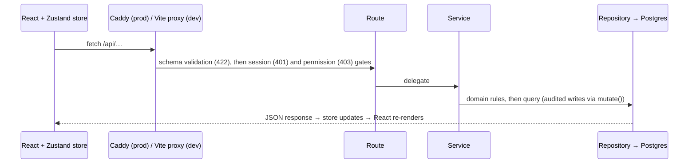
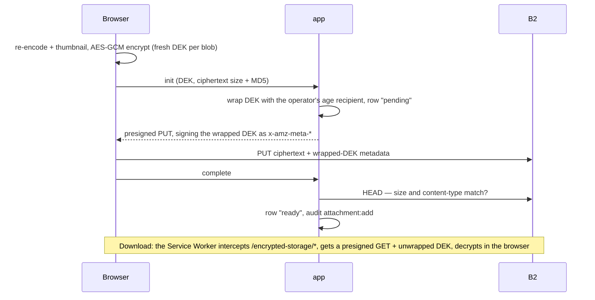
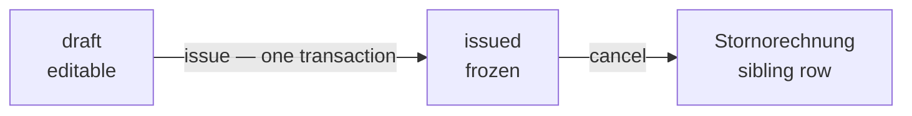

# Architecture

The high-level entry point to the implementation: where things live and how they fit together. Detail lives in the code, the [spec](docs/spec/index.md) and the [ADRs](docs/adr/index.md); this file links to it rather than restating it.

`AC-NNN` references throughout point to numbered Acceptance Criteria in [verification.md §15](docs/spec/verification.md#15-acceptance-criteria).

## Contents

- [Tech Stack](#tech-stack)
- [Architecture Overview](#architecture-overview)
- [Module Map](#module-map)
  - [Directory Detail](#directory-detail)
  - [Directory Notes](#directory-notes)
  - [Configuration Files](#configuration-files)
- [Request Lifecycle](#request-lifecycle)
- [API Surface](#api-surface)
- [Permission Gating](#permission-gating)
- [How to Extend](#how-to-extend)
  - [Adding a new entity](#adding-a-new-entity-eg-supplier)
  - [Adding a new view](#adding-a-new-view-eg-worker-view)
  - [Adding a new API endpoint](#adding-a-new-api-endpoint)
  - [Adding a new workflow state](#adding-a-new-workflow-state)
  - [Adding a new SSE event](#adding-a-new-sse-event)
  - [Seeding modes](#seeding-modes)
- [Infrastructure](#infrastructure)
  - [CI/CD Pipeline](#cicd-pipeline)
- [Attachments Module](#attachments-module)
- [Realtime Invalidation](#realtime-invalidation)
- [Invoices Module](#invoices-module)
- [Design Decisions (Not ADR-Worthy)](#design-decisions-not-adr-worthy)
- [Links](#links)

---

## Tech Stack

| Technology    | Version       | Purpose                                                          | Docs                                                                |
| ------------- | ------------- | ---------------------------------------------------------------- | ------------------------------------------------------------------- |
| TypeScript    | 6.0           | Language (strict, shared client+server)                          | [typescriptlang.org](https://www.typescriptlang.org/)               |
| React         | 19            | UI rendering                                                     | [react.dev](https://react.dev/)                                     |
| Vite          | 8             | Dev server, bundler, HMR                                         | [vite.dev](https://vite.dev/)                                       |
| Zustand       | 5             | Client-side state management                                     | [zustand](https://github.com/pmndrs/zustand)                        |
| React Router  | 8             | Client-side routing                                              | [reactrouter.com](https://reactrouter.com/)                         |
| Fastify       | 5             | HTTP server and API framework                                    | [fastify.dev](https://fastify.dev/)                                 |
| Drizzle ORM   | 0.45          | Type-safe SQL, schema, migrations                                | [orm.drizzle.team](https://orm.drizzle.team/)                       |
| PostgreSQL    | 17            | Relational database                                              | [postgresql.org](https://www.postgresql.org/)                       |
| Backblaze B2  | S3-compatible | Object/file storage (prod) — versioning + Compliance Object Lock | [backblaze.com/b2](https://www.backblaze.com/b2/cloud-storage.html) |
| MinIO         | S3-compatible | Object/file storage (dev mirror)                                 | [min.io](https://min.io/)                                           |
| Cloudflare R2 | S3-compatible | Encrypted DB-backup destination (Layer 2)                        | [r2 docs](https://developers.cloudflare.com/r2/)                    |
| Caddy         | 2             | Reverse proxy, automatic HTTPS                                   | [caddyserver.com](https://caddyserver.com/)                         |
| Vitest        | 4             | Unit and component tests                                         | [vitest.dev](https://vitest.dev/)                                   |
| Playwright    | 1.60          | End-to-end tests                                                 | [playwright.dev](https://playwright.dev/)                           |
| lychee        | 0.24          | Markdown link + anchor resolution in CI                          | [lychee](https://github.com/lycheeverse/lychee)                     |

Stack decisions are recorded in ADRs: [ADR-0002](docs/adr/0002-tech-stack-typescript-react-vite-zustand.md) (frontend), [ADR-0003](docs/adr/0003-deployment-infrastructure-vps-docker-compose-github-actions.md) (infra), [ADR-0004](docs/adr/0004-backend-stack-fastify-drizzle-node-postgres.md) (backend).

---

## Architecture Overview

Seven responsibility layers. Dependency flows left-to-right only, never reversed. The split on the server between **Services** and **Routes** is load-bearing — routes never touch repositories or db/schema directly; they delegate to services. See [spec §11.2](docs/spec/architecture.md#112-responsibility-boundaries) for the authoritative contract.

```
  config  <--  domain  <--  storage  <--  services  <--  routes
                        <--  state   <--  ui

  src/config/         src/domain/    src/server/repositories/   src/server/services/   src/server/routes/
                                     src/server/storage/                               src/server/middleware/
                                                                                       src/state/
                                                                                       src/ui/
```

- **Config** and **Domain** are shared: both server and client import them.
- **Storage**, **Services**, **Routes** run server-side only.
- **State**, **UI** run client-side only.

**Enforcement**: `no-restricted-imports` zones in [`eslint.config.js`](eslint.config.js) fail lint on any import against the arrows (e.g. `src/ui/**` → `src/server/**`, routes → repositories). Routes may type-import `Database` from `src/server/db/connection`.

---

## Module Map

Each `Owns` cell is a one-line summary. Below it, [§ Directory Detail](#directory-detail) carries the file list for the directories where the set of files _is_ the architecture, and [§ Directory Notes](#directory-notes) carries what a filename cannot tell you about the rest.

| Directory                      | Owns                                                                                                                                                   | Must NOT                                                                                                                                        |
| ------------------------------ | ------------------------------------------------------------------------------------------------------------------------------------------------------ | ----------------------------------------------------------------------------------------------------------------------------------------------- |
| `src/config/`                  | Deployment-tunable constants and catalogs. Every `[C]` value is indexed in [§ Configuration Files](#configuration-files).                              | Import anything outside `src/config/`                                                                                                           |
| `src/domain/`                  | Framework-free types and pure rules: transitions, aging, summaries, dates, envelopes, image pipeline.                                                  | Import from state, API, storage, or UI                                                                                                          |
| `src/server/config/`           | Env validation (Zod), centralized policy constants (auth, rate limits, storage), VAPID key material.                                                   | Contain business logic or import from layers above                                                                                              |
| `src/server/db/`               | Drizzle schema, connection, SQL migrations, named constraints (`constraints.ts`).                                                                      | Contain business logic                                                                                                                          |
| `src/server/services/`         | Business logic orchestration — one service per entity, plus the audit, backup, notification, attachment, key-envelope, invoice and takeout subsystems. | Know about HTTP, Fastify, or request objects                                                                                                    |
| `src/server/services/invoice/` | The EN 16931 e-invoicing core (ADR-0026) — Factur-X builder, PDF/A-3 drawer, payload crypto, XSD validation.                                           | Know about HTTP, Fastify, or request objects                                                                                                    |
| `src/server/repositories/`     | Database queries, one module per entity, plus the role-based read-scope predicates.                                                                    | Know about HTTP or contain business rules                                                                                                       |
| `src/server/storage/`          | S3/MinIO client, presign / upload / download / hide / restore ops, boot-time safety probes.                                                            | Be called outside routes, `start.ts` (client wiring) and the operator CLIs (`deploy-preflight-cli.ts`, `scripts/binary-key/recover-objects.ts`) |
| `src/server/middleware/`       | Cookie parsing, session auth, request decoration.                                                                                                      | Contain route handlers or business logic                                                                                                        |
| `src/server/routes/`           | Route definitions, request validation, response serialization.                                                                                         | Access repositories directly (must go through services)                                                                                         |
| `src/server/sse/`              | In-process SSE bus — typed pub/sub fan-out to subscribed connections.                                                                                  | Know about HTTP, Fastify, or request objects                                                                                                    |
| `src/server/seed/`             | Seed data split per data class, shipped through the public restore contract.                                                                           | Contain app logic; run in production                                                                                                            |
| `src/server/data/`             | Static data files (e.g. common-passwords list).                                                                                                        | Contain logic or import from other modules                                                                                                      |
| `src/server/` (root files)     | App assembly, entry point, bootstrap, schedulers and reapers, error factories.                                                                         | -                                                                                                                                               |
| `src/state/`                   | Zustand stores (one per domain slice), barrel re-export, client-side cache.                                                                            | Access the database or import server code                                                                                                       |
| `src/sse/`                     | Browser-side SSE primitive — `onSseEvent` over an `EventSource`.                                                                                       | Contain business logic or import server code                                                                                                    |
| `src/api/`                     | Centralized API client, typed fetch wrappers.                                                                                                          | Contain business logic or UI concerns                                                                                                           |
| `src/hooks/`                   | Shared React hooks (transitions, routing, permission gating).                                                                                          | Contain API calls directly (must use stores)                                                                                                    |
| `src/pwa/`                     | Web Push client plumbing (subscribe, permission prompt).                                                                                               | Contain business logic; import server code                                                                                                      |
| `src/sw/`                      | The one Service Worker: attachment decrypt-on-fetch and push.                                                                                          | Contain business logic; import server code                                                                                                      |
| `src/ui/`                      | React components, grouped by feature area.                                                                                                             | Contain business logic beyond dispatching to state                                                                                              |
| `src/test/`                    | Shared test setup, API test helpers, and seed fixtures.                                                                                                | Be imported in production code                                                                                                                  |

### Directory Detail

**Each subsection is a coverage contract** (AC-350): it names every source file directly in its directory, and `scripts/check-module-map.sh` fails the build on an omitted file or a dead name. The gated set is recorded in `scripts/module-map-gated.txt`, so dropping a subsection is a reviewable diff. Only directories whose file set _is_ the architecture get one.

#### `src/server/routes/`

- `auth.ts` — login / logout / `me` / change-password; the only module that sets the session cookie
- `users.ts` — user CRUD, deactivate / reactivate, admin password reset
- `workers.ts` — the assignee pool, `project:read`-gated and limited to `{userId, displayName}`
- `customers.ts` — customer CRUD
- `projects.ts` — project CRUD, transitions, date edits, archive / restore / purge
- `invoices.ts` — drafts, issue / cancel, server-decrypted PDF, ZIP export, year list (ADR-0026)
- `company-profile.ts` — singleton `GET` + owner-only `PUT`
- `audit.ts` — read-only list + get-by-id
- `extract.ts` — LLM email-to-structured-data via OpenRouter (ADR-0016)
- `notification-rules.ts` — notification rule CRUD (ADR-0023)
- `push-subscriptions.ts` — Web Push subscribe / unsubscribe
- `push.ts` — VAPID public key
- `health.ts` — `GET /api/health`
- `attachments.ts` — init / complete / delete / list / download-url / bulk-fetch
- `storage-usage.ts` — per-project and global storage usage
- `events.ts` — `GET /api/events`, the SSE channel (ADR-0025)
- `export-jobs.ts` / `import-jobs.ts` — server-side takeout jobs (ADR-0018/0024)

#### `src/server/services/invoice/`

The EN 16931 core (ADR-0026). Gated on its own: coverage reaches direct children only.

- `facturXmlBuilder.ts` — the embedded `factur-x.xml` (CII, Comfort profile)
- `pdfDrawer.ts` — the human-readable A4 body (structurally PDF/A-3, not certified)
- `xsdValidator.ts` — validates every render against the bundled schemas in `src/server/services/invoice/xsd/`
- `payloadCrypto.ts` — AES-256-GCM envelope for the rendered PDF, wire-identical to the browser's
- `logoAsset.ts` — the brand logo for the PDF; never throws inside issuance
- `boilerplate.ts` — per-tax-mode legal text, CategoryCode and exemption reason

#### `src/server/` (root files)

- `app.ts` — app assembly (`buildApp()`)
- `start.ts` — entry point
- `bootstrap.ts` — first-run admin bootstrap
- `health.ts` — health probe
- `seed.ts` — seed orchestrator, delegates to `src/server/seed/`
- `password.ts` — `bcryptjs` wrapper; the 72-byte ceiling is in `src/server/config/password-policy.ts`
- `staticRoot.ts` — the one definition of `dist/` and `public/` on disk
- `staticCache.ts` — static file serving and its Cache-Control tiers
- `deploy-preflight-cli.ts` — deploy-time config and storage checks (AC-230/231)
- `periodicSweeper.ts` — shared factory behind the reaper and retention schedulers
- `session-reaper.ts` — session reaper (predates the factory)
- `audit-retention-scheduler.ts` — audit retention (ADR-0021)
- `attachment-orphan-reaper-scheduler.ts` — pending-attachment reaper
- `attachment-hidden-reaper-scheduler.ts` — hidden-attachment reaper
- `takeout-staging-reaper-scheduler.ts` — takeout staging reaper
- `threshold-monitor-scheduler.ts` — threshold monitor
- `bucket-orphan-prune-scheduler.ts` — bucket ↔ DB reconciliation (#169)
- `backup-runner.ts` — backup CLI: `schedule` / `run` / `drill` (ADR-0020)
- `errors.ts` — error factories returning `AppError`
- `error-handler.ts` — global error and 404 handlers
- `format-error-chain.ts` — surfaces the real cause and SQLSTATE of a wrapped driver error

### Directory Notes

What a filename does not tell you. Not a file list. Names resolve under their bold directory key (`scripts/check-module-map.sh`).

**`src/config/`** — `sseEvents.ts` is the SSE event catalogue shared by server and client, not a tunable.

**`src/server/config/`** — `vapid.ts` derives the VAPID public key from the private one and auto-bootstraps it in dev.

**`src/server/services/`** — one service per entity, plus subsystems:

- `mutate.ts` — the single write path for audited tables (ADR-0021).
- `events.ts` — the **domain** event bus (audit, notifications). Not the SSE pair `src/server/routes/events.ts` / `src/server/sse/`.
- `KeyEnvelopeService.ts` — the entire crypto perimeter on B2 ciphertext (ADR-0024).
- `backup.ts`, `backup-drill.ts`, `ephemeralPg.ts`, `r2Uploader.ts` — the Layer 2 backup pipeline (ADR-0020).
- `threshold-monitor.ts` — runs in `app`, not `backup`: the notification publisher binds there.
- `DataExchangeJobService.ts`, `takeout-export-builder.ts`, `takeout-export-runner.ts`, `takeout-import-runner.ts`, `takeout-staging.ts`, `takeout-staging-reaper.ts`, `data-exchange-boot-reaper.ts` — the takeout subsystem.
- Bulk download has **no** server-side orchestrator: the browser assembles the zip (ADR-0024). Absence is a decision.

**`src/server/repositories/`** — audited-table writes take a `MutatingDatabase` (transaction-only), so bypassing `mutate()` fails `tsc`. `scope.ts` holds the role-based read-scope predicates (ADR-0019).

**`src/server/seed/`** — `business.ts` seeds through `ImportService.import`, exercising the public restore contract. Only `src/test/api-helpers.ts` inserts users directly.

**`src/build/`** — Vite plugins. `brandAppShell.ts` brands `index.html` and generates the PWA manifest (AC-363). Modules here sit in the Vite config's import graph, and Vite's native config loader does no extension resolution — so their imports carry explicit `.ts` extensions.

**`src/ui/`** — `src/ui/detail/ProjectDetailPage.tsx` is the full page; `ProjectDetailPanel.tsx` is the quick-glance overlay on Kanban / Calendar.

### Configuration Files

Maps spec `[C]` markers (values that vary per deployment) to files. For how operator-supplied env vars are validated and what happens when one is missing, see [Design Decisions § Configuration boundary](#design-decisions-not-adr-worthy) below and [spec architecture.md §12](docs/spec/architecture.md#12-configuration-boundaries).

| What                                                                                | File                                   |
| ----------------------------------------------------------------------------------- | -------------------------------------- |
| App name, branding, footer brand line, brand accent (light + dark), logo asset path | `src/config/brandingConfig.ts`         |
| Color design tokens — primitive palette, semantic tokens, dark overrides            | `src/styles/tokens.css`                |
| Workflow states (labels, colors, order, aging thresholds, collapse tiers)           | `src/config/stateConfig.ts`            |
| German UI and error strings                                                         | `src/config/strings.ts`                |
| Date and locale display settings                                                    | `src/config/localeConfig.ts`           |
| Insecure-connection detection                                                       | `src/config/insecureConnection.ts`     |
| Password policy (min length, max bytes, blocklist)                                  | `src/server/config/password-policy.ts` |
| Session duration, rate-limit windows                                                | `src/server/config/index.ts`           |
| Role set and per-role permission matrix                                             | `src/config/permissions.ts`            |
| Per-view nav + route-guard rules (URL ↔ view ↔ access rule)                         | `src/config/routes.ts`                 |
| Backup-freshness thresholds (amber/red days for backup and drill)                   | `src/config/backupThresholds.ts`       |
| Threshold-monitor policy (storage warn band, hysteresis, sweep, re-notify)          | `src/config/thresholdMonitor.ts`       |
| Destructive-restore confirmation phrase                                             | `src/config/dataExchangeConfig.ts`     |
| Theme preference local-storage key                                                  | `src/config/themeStorage.ts`           |
| Audit retention window (ADR-0021)                                                   | `src/config/auditRetention.ts`         |
| Audit action → German label map                                                     | `src/config/auditActionLabels.ts`      |
| Audit list page size                                                                | `src/config/auditPageSize.ts`          |
| Notification event catalog + German labels (ADR-0023)                               | `src/config/notificationEvents.ts`     |
| Push-dispatch latency budget                                                        | `src/config/pushDispatch.ts`           |
| Role keys (typed `AccountRoleKey` enum)                                             | `src/config/roleKeys.ts`               |
| Attachment server caps (size, bulk, reaper TTL, worker self-delete grace)           | `src/config/attachmentConfig.ts`       |
| Attachment client pipeline params (resize, quality, thumbnail dimension)            | `src/config/attachmentPipeline.ts`     |
| Realtime SSE heartbeat interval (default 25 s, bounded 1 s–600 s)                   | `src/server/config/env.ts`             |
| Seed default password                                                               | `src/test/seedAssumptions.ts`          |

---

## Request Lifecycle



**Client IP.** `request.ip` keys the login rate limiter and the audit trail, so Fastify trusts `X-Forwarded-For` only from `TRUSTED_PROXY_CIDRS` (the compose network); production refuses to start without it (`src/server/config/env.ts`).

---

## API Surface

Routes live in `src/server/routes/`, and `buildApp()` (`src/server/app.ts`) registers every one — `eslint.config.js` fails the build on a route mounted elsewhere, so generated artifacts see the whole surface.

- **Contract:** [api.md §14.2](docs/spec/api.md#142-operations).
- **Endpoint table and OpenAPI document** (generated, CI-checked): [docs/api/](docs/api/README.md).
- **Error codes:** `ERROR_CODES` in `src/server/errors.ts`, mirrored in [api.md §14.4.1](docs/spec/api.md#1441-error-categories) (AC-354).
- **Access model:** [§ Permission Gating](#permission-gating).

---

## Permission Gating

- **One matrix, two layers.** `src/config/permissions.ts` feeds server gates (`requirePermission`, 403) and UI affordances (`usePermission`). The server is authoritative. UI code asks for a permission, not a role — except owner-only surfaces (company profile, backup badge) ([api.md §14.3](docs/spec/api.md#143-authorization-rules)).
- **One exception:** `requireRole('owner')` on `PUT /api/company-profile` — the spec mints no `company_profile:*` key for a singleton.
- **Navigation:** `src/config/routes.ts` declares each view's access rule as data; nav, route guard and landing derive from it.
- **Data scoping is orthogonal** ([ADR-0019](docs/adr/0019-worker-data-scoping-repository-layer-predicate.md)): permissions grant the capability, `src/server/repositories/scope.ts` narrows the rows.
- Both matrices are mirrored in the spec and checked against the code (AC-343, AC-349).

---

## How to Extend

Common changes and where to look. The dependency direction in [Architecture Overview](#architecture-overview) is the only invariant. Conventions are in [CONTRIBUTING.md](CONTRIBUTING.md).

### Adding a new entity (e.g., Supplier)

**Pattern to copy**: the `Project` entity — read `schema.ts`, `types.ts`, the repo/service/route/store/UI chain for projects.

1. **Schema**: add the table in `src/server/db/schema.ts` (audit fields as on `projects`), then regenerate `0000_baseline.sql` and reapply its hand-edited tail — no incremental migrations ([ADR-0026](docs/adr/0026-invoices-immutability-and-zugferd.md)). Existing databases: [recover-from-schema-change.md](docs/ops/recover-from-schema-change.md).
2. **Domain types**: add interface in `src/domain/types.ts`. Optional fields stay optional ([spec §13.5](docs/spec/architecture.md#135-robustness)).
3. **Repository**: split by concern (`src/server/repositories/supplier-read.ts`, etc.), barrel re-export. Add a `toSupplier(row)` projection so Drizzle types don't leak upward.
4. **Service**: `src/server/services/SupplierService.ts`. Must not import `fastify` types ([spec §11.2](docs/spec/architecture.md#112-responsibility-boundaries)).
5. **Routes**: `src/server/routes/suppliers.ts`, register in `app.ts`. Routes go through the service, never call repos directly.
6. **API client**: add a `supplierApi` block in `src/api/client.ts` (same shape as `projectApi`).
7. **State**: `src/state/supplierStore.ts` (model on `projectStore.ts`, optimistic updates with rollback).
8. **UI**: components under `src/ui/suppliers/`.
9. **Tests**: domain in `src/domain/__tests__/`, integration in `src/server/__tests__/` (copy `projects-list.test.ts`), component in the feature's own `__tests__/` (e.g. `src/ui/detail/__tests__/`).
10. **Seed**: extend the relevant loader under `src/server/seed/` (`users.ts` for new user records; `business.ts` for customer/project-like entities that should flow through `ImportService`).
11. **Spec**: update `docs/spec/data-model.md`, `docs/spec/api.md §14.2`, `docs/spec/verification.md`.

### Adding a new view (e.g., Worker view)

**Pattern to copy**: `src/ui/kanban/KanbanBoard.tsx`, `src/state/projectStore.ts` (`getProjectsByState`), `src/config/routes.ts` (ROUTES table), `src/domain/types.ts` (`ViewMode` union).

1. Add view name to `ViewMode` in `src/domain/types.ts`.
2. Create component under `src/ui/<view>/`. Reads from `useProjectStore`, filters client-side.
3. Add an entry to `ROUTE_DEFINITIONS` in `src/config/routes.ts` with an `access` rule; for a landing view, add it to `LANDING_ORDER` (first match wins). Add its row to the spec's nav matrix ([ui/index.md §8.7.1](docs/spec/ui/index.md#871-views)) — `src/config/__tests__/routes.test.ts` fails until they agree.
4. Wire the component into the `VIEW_ELEMENTS` lookup in `src/App.tsx` so `<Routes>` knows what to render for the new key.
5. Tests: copy structure from `src/ui/detail/__tests__/ProjectDetailPage.test.tsx`.

Backend changes are usually not needed — the store exposes the full project list. If the view needs a query the store can't answer, add it to `projectStore.ts` (keeps the cache coherent) rather than a new store.

### Adding a new API endpoint

**Pattern to copy**: `src/server/routes/projects.ts`, `src/server/services/ProjectCrudService.ts`, `docs/spec/api.md §14.2`.

1. **Where**: extend an existing route file if it belongs to that entity/group; create a new one otherwise.
2. **Validation**: Fastify JSON Schema on the route (see `projects.ts`). Don't validate inside the handler.
3. **Auth**: `requireSession(app, db)` once per plugin, `requirePermission('...')` per route; new keys go in `src/config/permissions.ts`. The endpoint table regenerates — no row to add by hand.
4. **Delegate to service**. Never call repos from a route ([spec §11.2](docs/spec/architecture.md#112-responsibility-boundaries)).
5. **Errors**: factories from `src/server/errors.ts`, never a raw `Error`. Map DB constraint violations in the service against `src/server/db/constraints.ts` (pattern: `ProjectCrudService.createProjectWithClientId`).
6. **Register** in `src/server/app.ts`.
7. **Tests**: integration in `src/server/__tests__/` using `api-helpers.ts` (`startApp()`, `login()`, `authPost()`/`authGet()`).
8. **Spec**: add operation to `docs/spec/api.md §14.2`, AC in `docs/spec/verification.md`.

### Adding a new workflow state

Most of the Kanban, calendar, and aging rendering is genuinely config-driven. Two specific places still hardcode boundary-state literals and will need updating in addition to the config:

1. Update the state array in `src/config/stateConfig.ts` (name, type, color, aging thresholds, collapse tier).
2. **Boundary states**: `src/domain/transitions.ts` hardcodes `'anfrage'` (first) and `'erledigt'` (terminal). Update them only if the new state takes the first or last position.
3. **Database constraints**: `src/server/db/schema.ts` has (a) a `status` column default of `'anfrage'` and (b) a `projects_valid_status` CHECK constraint that hard-codes all nine state literals. Adding, renaming or removing a state means regenerating the baseline (see the entity recipe), or the DB rejects the new state.
4. **Hardcoded test fixtures**: a couple of tests pin the full state list — grep for the state keys and update as needed.
5. Re-seed the database if existing data must be migrated to a new state (`SEED=force npm run dev`).

This is not a zero-code-change operation. Improving it toward full configurability is tracked in [spec §3](docs/spec/index.md#3-workflow-states).

### Adding a new SSE event

**Pattern to copy**: `INVOICE_CHANGED` — `src/config/sseEvents.ts`, `emitInvoiceChanged` in `src/server/sse/emitters.ts`, `src/state/invoiceSseSubscription.ts`.

1. Add the event constant to `src/config/sseEvents.ts` and to `SSE_EVENT_NAMES` — backs the `SseEventName` union and the AC-338 coverage guard.
2. Add a typed `emitXChanged()` helper in `src/server/sse/emitters.ts`; call it post-commit from the mutation call site, never inside the transaction ([spec §11.13](docs/spec/architecture.md#1113-realtime-invalidation-channel)).
3. Add ≥1 client subscriber under `src/state/` via `onSseEvent` (`src/sse/client.ts`) — an emit-only event fails `src/state/__tests__/sseSubscriberCoverage.test.ts` (AC-338).
4. Wire the subscription into the auth-gated `useEffect` in `src/App.tsx`, alongside the existing SSE subscriptions.
5. **Spec**: add the event to the v1 catalog and emitter list in `docs/spec/architecture.md §11.13` and `docs/spec/api.md §14.2.13`.

### Seeding modes

The seed loader (`src/server/seed.ts`) is controlled by environment:

- **Production** (`NODE_ENV=production`): seeding is skipped entirely — the start-up path in `src/server/start.ts` never calls it.
- **`SEED=false`** (default — see `src/server/config/env.ts` and `docker-compose.yml`): no seeding. Seeds never run without an explicit opt-in.
- **`SEED=true`**: loads seed data if the database is empty; no-ops if data already exists.
- **`SEED=force`**: drops all seed records and reloads from scratch. Use after schema changes or to refresh stale demo dates.

Run via `SEED=true npm run dev` (or `SEED=force` for a hard refresh) or set in `.env`.

---

## Infrastructure


| Service                   | Role                                                                                                      |
| ------------------------- | --------------------------------------------------------------------------------------------------------- |
| `app`                     | API + SPA. A tmpfs holds the operator-loaded binary `age` identity; boot refuses without it (ADR-0024).   |
| `db`                      | Postgres 17 with page checksums (AC-366).                                                                 |
| `backup`                  | Encrypted R2 backups and restore drills on an in-process schedule (ADR-0020). `backup` compose profile.   |
| `caddy`                   | Reverse proxy; custom xcaddy build for DNS-01 ACME.                                                       |
| `storage`, `storage-init` | MinIO and its bucket bootstrap — dev/CI only (`docker-compose.minio.yml`); deployments use B2 (ADR-0022). |

Overlays: `docker-compose.dev.yml` (DB + storage for `npm run dev`), `docker-compose.http.yml` (HTTP-only evaluation, ADR-0013).

### CI/CD Pipeline


- **Build once, promote on merge** ([ADR-0011](docs/adr/0011-build-images-in-ci-distribute-via-ghcr.md)): the scanned and smoked image is the deployed one; later stages only re-tag.
- **Deploy is manual and pull-based** ([ADR-0012](docs/adr/0012-manual-pull-based-deploy-over-wireguard.md), [manual-deploy.md](docs/ops/manual-deploy.md)).
- **Outside the merge gate:** `e2e.yml` (Playwright, nightly — a green PR does not imply green E2E), `security-scheduled.yml` (nightly OSV sweep), `notify.yml` (assigns on red; a `ci-red` issue for `main`), `cache-cleanup.yml`, `ghcr-retention.yml`.
- Per-job rationale lives in the comments of each workflow under `.github/workflows/`.

---

## Attachments Module

Contract: [data-model.md §5.13](docs/spec/data-model.md#513-attachment), [api.md §14.2.11](docs/spec/api.md#14211-attachments). Design: [ADR-0024](docs/adr/0024-binary-attachment-e2e-encryption.md) (end-to-end encryption), [ADR-0022](docs/adr/0022-binary-storage-b2-compliance-object-lock.md) (versioned bucket, Compliance lock — nothing destroys a version).



| Concern                                                          | Where                                                                                              |
| ---------------------------------------------------------------- | -------------------------------------------------------------------------------------------------- |
| Client re-encode, thumbnail, EXIF                                | `src/domain/imagePipeline.ts`, parameters in `src/config/attachmentPipeline.ts`                    |
| State machine `pending → ready ↔ hidden`, bulk fetch             | `src/server/services/AttachmentService.ts`                                                         |
| DEK wrap / unwrap                                                | `src/server/services/KeyEnvelopeService.ts`                                                        |
| Decrypt-on-fetch and push, one Service Worker                    | `src/sw/index.ts`                                                                                  |
| Storage client; internal vs browser-facing endpoint              | `src/server/storage/client.ts`                                                                     |
| Self-describing objects; DB-less recovery (AC-372/373)           | `src/server/storage/objectMetadata.ts`, `src/server/storage/recoverObjects.ts`                     |
| Boot probes: bucket shape, credential capability, `age` identity | `src/server/storage/safety.ts`, `src/server/storage/binaryIdentity.ts`                             |
| No version-destroying delete anywhere (AC-238)                   | `src/server/__tests__/storage-architecture-detector.ts`                                            |
| Pending-row reaper                                               | `src/server/services/attachment-orphan-reaper.ts`                                                  |
| Storage usage — trigger-maintained side table                    | `project_storage_usage` in `src/server/db/schema.ts`; `src/server/services/StorageUsageService.ts` |
| Takeout export / import (server-side jobs)                       | `src/server/services/takeout-export-runner.ts`, `src/server/services/takeout-import-runner.ts`     |

## Realtime Invalidation

Contract: [architecture.md §11.13](docs/spec/architecture.md#1113-realtime-invalidation-channel); design: [ADR-0025](docs/adr/0025-realtime-ui-invalidation-via-sse.md). One SSE channel (`src/server/routes/events.ts`) carries payload-free invalidation hints; clients refetch.

- **Server:** in-process bus `src/server/sse/bus.ts`; one typed emitter per event in `src/server/sse/emitters.ts`, called post-commit.
- **Catalogue:** `src/config/sseEvents.ts`.
- **Client:** `src/sse/client.ts` (`onSseEvent`); stores subscribe and refetch.

---

## Invoices Module

Contract: [data-model.md §5.15–§5.17](docs/spec/data-model.md#515-invoice-entity), [api.md §14.2.14–§14.2.15](docs/spec/api.md#14214-invoice-operations). Design: [ADR-0026](docs/adr/0026-invoices-immutability-and-zugferd.md) (immutability, ZUGFeRD, libraries). GoBD system description: [Verfahrensdokumentation](docs/compliance/verfahrensdokumentation.md).



Issuing, in one transaction: allocate the gapless number → freeze the snapshot → render PDF/A-3 with embedded `factur-x.xml` (XSD-validated; failure rolls everything back) → store the PDF under a per-object Compliance lock → project to `abgerechnet` → audit row + `invoice_changed`.

| Concern                                              | Where                                                                                                                                |
| ---------------------------------------------------- | ------------------------------------------------------------------------------------------------------------------------------------ |
| Route facade; issue; cancel                          | `src/server/services/InvoiceService.ts`, `src/server/services/InvoiceIssueService.ts`, `src/server/services/InvoiceCancelService.ts` |
| Immutability backstop below the services             | `invoices_enforce_immutability` trigger in `src/server/db/migrations/0000_baseline.sql`                                              |
| Gapless number per `(year, kind)`                    | `invoice_sequence` in `src/server/db/schema.ts`                                                                                      |
| PDF/A-3 + Factur-X (drawer, XML, XSD, tax-mode text) | `src/server/services/InvoiceRenderer.ts`, `src/server/services/invoice/`                                                             |
| PDF storage — off the attachment API, locked         | `src/server/services/InvoiceBinaryService.ts`, `INVOICE_PDF_KEY_PREFIX` in `src/server/repositories/attachment.ts`                   |
| Bookkeeper bulk export                               | `src/server/services/InvoiceExportService.ts`                                                                                        |
| Client stores                                        | `src/state/invoiceStore.ts` (per project), `src/state/invoiceListStore.ts` (`/rechnungen`)                                           |

Workers are excluded by the repository scope predicate ([ADR-0019](docs/adr/0019-worker-data-scoping-repository-layer-predicate.md)), not by a permission gate.

---

## Design Decisions (Not ADR-Worthy)

- **Export format**: JSON only, one envelope ([data-model.md §5.8](docs/spec/data-model.md#58-export-envelope)). Import preserves IDs and wipes-then-restores — no merge semantics ([ADR-0018](docs/adr/0018-data-persistence-and-recovery-layered-strategy.md)).
- **Project number format**: configurable `[C]`, enforced only for uniqueness.
- **Site vs billing address**: `projects.siteAddress` (Baustelle) beside `customers.address` (Rechnung) — the standard ERP split; null means "at the billing address". No `addresses` table: no need for several per customer.
- **Bulk transitions**: not supported.
- **One DB role** (`pm`) serves app, backup and migrations. The integrity backstop is external (immutable R2 backups, B2 Compliance lock); a least-privilege split would only stop an attacker holding the app but not the host (#418).
- **Client-side routing**: declarative mode (`<BrowserRouter>`, no data router). `src/config/routes.ts` is the single route table — URL, access rule, per-role landing; nav and guard derive from it, landing from its `LANDING_ORDER`.
- **Escape-to-dismiss**: every Esc-closable surface registers on the LIFO `src/hooks/escapeStack.ts`, so only the topmost closes. Modals use `src/ui/common/useDialogA11y.ts`, the rest `src/hooks/useEscapeKey.ts`; no hand-rolled `keydown` listeners.
- **Menu close on outside click**: `src/ui/common/MenuBackdrop.tsx`, an invisible overlay, so one click closes the menu without activating what lies beneath (#130).
- **Errors**: `src/server/error-handler.ts` passes Fastify 4xx through as stable codes; an `AppError` keeps its own; any other 5xx or status-less error becomes `SERVER_ERROR` ([api.md §14.4.2](docs/spec/api.md#1442-error-principles)). Every `pg.Pool` gets an error listener; uncaught errors log once and exit.
- **Configuration boundary** ([architecture.md §12.6](docs/spec/architecture.md#126-feature-manifest-and-operator-confidence)): env schema vs examples in CI (`scripts/check-env-drift.sh`), aggregated validation in deploy pre-flight (`src/server/deploy-preflight-cli.ts`), and a boot-time feature manifest (`src/server/config/features.ts`).
- **Documentation drift guards** — each fails the build (traceability only warns on a `[crit]` coverage gap). The rule: generate what is expensive to repair by hand, or what a check would need the generator's machinery for anyway (the endpoint table: `buildApp()` route collection); check the rest.

| Kind                      | Guards                                                                                                                                                                                          |
| ------------------------- | ----------------------------------------------------------------------------------------------------------------------------------------------------------------------------------------------- |
| Generated from code       | `docs/api/openapi.json` (AC-351), the endpoint table (AC-352) — see [docs/api/](docs/api/README.md)                                                                                             |
| `CHECKED:` blocks vs code | permission matrix (AC-343), nav matrix (AC-349), error codes (AC-354) — read via `src/test/checkedBlock.ts`                                                                                     |
| Verified without a source | doc paths (AC-347, `scripts/check-doc-paths.sh`), Module Map (AC-350, `scripts/check-module-map.sh`), links and anchors (AC-348, `lychee.toml`), traceability (`scripts/check-traceability.sh`) |

Prettier formats the whole repository (#361); its exceptions are in `.prettierignore`.

---

## Links

| Resource                        | Location                                           |
| ------------------------------- | -------------------------------------------------- |
| Product specification           | [docs/spec/](docs/spec/index.md)                   |
| Architecture Decision Records   | [docs/adr/](docs/adr/index.md)                     |
| Contributing guide and workflow | [CONTRIBUTING.md](CONTRIBUTING.md)                 |
| Data persistence and recovery   | [DATA.md](DATA.md)                                 |
| Vision and kickoff              | [docs/project/kickoff.md](docs/project/kickoff.md) |
