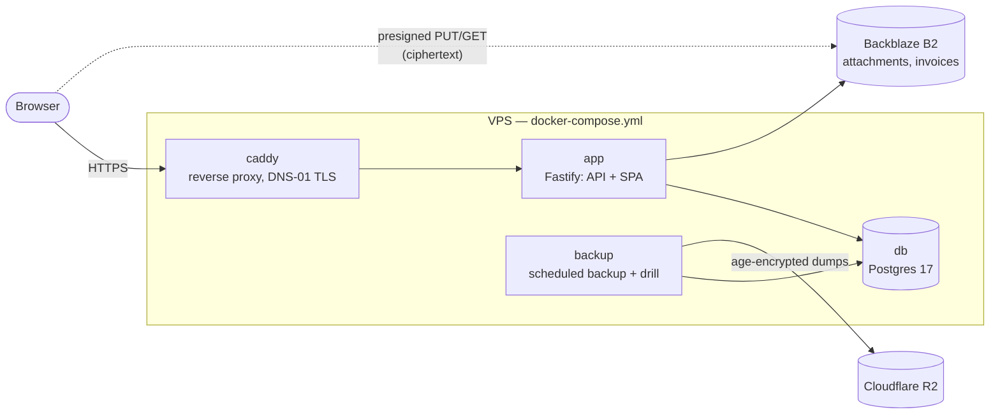
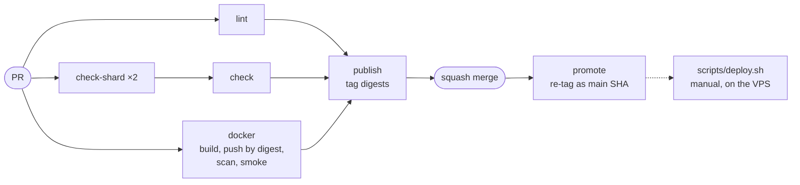
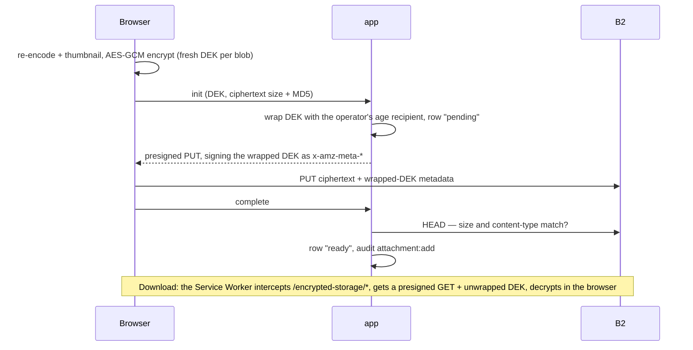

# Architecture

Navigation guide to the implementation. Use it to locate modules, understand dependency rules, and find the right file before diving into code. Not a substitute for reading the code itself.

For the full product specification, see [docs/spec/](docs/spec/index.md). `AC-NNN` references throughout point to numbered Acceptance Criteria in [verification.md §15](docs/spec/verification.md#15-acceptance-criteria).

**Length — a standing D-BLSI exception** ([review/conventions-docs-general.md](review/conventions-docs-general.md)). An index is worth reading because one file answers "where does this live?" for the whole tree; splitting it by section puts half the answers behind a link and reintroduces the drift the [§ Module Map](#module-map) gate exists to catch. Depth is what is delegated instead: [docs/spec/](docs/spec/index.md) and [docs/adr/](docs/adr/index.md) carry the reasoning, this file the map.

## Contents

- [Tech Stack](#tech-stack)
- [Architecture Overview](#architecture-overview)
- [Module Map](#module-map)
  - [Directory Detail](#directory-detail)
  - [Directory Notes](#directory-notes)
  - [Configuration Files](#configuration-files)
- [Request Lifecycle](#request-lifecycle)
- [API Surface](#api-surface)
- [Permission Gating](#permission-gating)
- [How to Extend](#how-to-extend)
  - [Adding a new entity](#adding-a-new-entity-eg-supplier)
  - [Adding a new view](#adding-a-new-view-eg-worker-view)
  - [Adding a new API endpoint](#adding-a-new-api-endpoint)
  - [Adding a new workflow state](#adding-a-new-workflow-state)
  - [Adding a new SSE event](#adding-a-new-sse-event)
  - [Seeding modes](#seeding-modes)
- [Infrastructure](#infrastructure)
  - [CI/CD Pipeline](#cicd-pipeline)
- [Attachments Module](#attachments-module)
- [Realtime Invalidation](#realtime-invalidation)
- [Invoices Module](#invoices-module)
- [Design Decisions (Not ADR-Worthy)](#design-decisions-not-adr-worthy)
- [Links](#links)

---

## Tech Stack

| Technology    | Version       | Purpose                                                          | Docs                                                                |
| ------------- | ------------- | ---------------------------------------------------------------- | ------------------------------------------------------------------- |
| TypeScript    | 6.0           | Language (strict, shared client+server)                          | [typescriptlang.org](https://www.typescriptlang.org/)               |
| React         | 19            | UI rendering                                                     | [react.dev](https://react.dev/)                                     |
| Vite          | 8             | Dev server, bundler, HMR                                         | [vite.dev](https://vite.dev/)                                       |
| Zustand       | 5             | Client-side state management                                     | [zustand](https://github.com/pmndrs/zustand)                        |
| React Router  | 8             | Client-side routing                                              | [reactrouter.com](https://reactrouter.com/)                         |
| Fastify       | 5             | HTTP server and API framework                                    | [fastify.dev](https://fastify.dev/)                                 |
| Drizzle ORM   | 0.45          | Type-safe SQL, schema, migrations                                | [orm.drizzle.team](https://orm.drizzle.team/)                       |
| PostgreSQL    | 17            | Relational database                                              | [postgresql.org](https://www.postgresql.org/)                       |
| Backblaze B2  | S3-compatible | Object/file storage (prod) — versioning + Compliance Object Lock | [backblaze.com/b2](https://www.backblaze.com/b2/cloud-storage.html) |
| MinIO         | S3-compatible | Object/file storage (dev mirror)                                 | [min.io](https://min.io/)                                           |
| Cloudflare R2 | S3-compatible | Encrypted DB-backup destination (Layer 2)                        | [r2 docs](https://developers.cloudflare.com/r2/)                    |
| Caddy         | 2             | Reverse proxy, automatic HTTPS                                   | [caddyserver.com](https://caddyserver.com/)                         |
| Vitest        | 4             | Unit and component tests                                         | [vitest.dev](https://vitest.dev/)                                   |
| Playwright    | 1.60          | End-to-end tests                                                 | [playwright.dev](https://playwright.dev/)                           |
| lychee        | 0.24          | Markdown link + anchor resolution in CI                          | [lychee](https://github.com/lycheeverse/lychee)                     |

Stack decisions are recorded in ADRs: [ADR-0002](docs/adr/0002-tech-stack-typescript-react-vite-zustand.md) (frontend), [ADR-0003](docs/adr/0003-deployment-infrastructure-vps-docker-compose-github-actions.md) (infra), [ADR-0004](docs/adr/0004-backend-stack-fastify-drizzle-node-postgres.md) (backend).

---

## Architecture Overview

Seven responsibility layers. Dependency flows left-to-right only, never reversed. The split on the server between **Services** and **Routes** is load-bearing — routes never touch repositories or db/schema directly; they delegate to services. See [spec §11.2](docs/spec/architecture.md#112-responsibility-boundaries) for the authoritative contract.

```
  config  <--  domain  <--  storage  <--  services  <--  routes
                        <--  state   <--  ui

  src/config/         src/domain/    src/server/repositories/   src/server/services/   src/server/routes/
                                     src/server/storage/                               src/server/middleware/
                                                                                       src/state/
                                                                                       src/ui/
```

- **Config** and **Domain** are shared: both server and client import them.
- **Storage**, **Services**, **Routes** run server-side only.
- **State**, **UI** run client-side only.

**Enforcement**: the layer rules are machine-enforced by `no-restricted-imports` zones in [`eslint.config.js`](eslint.config.js). A PR that reaches from `src/ui/**` into `src/server/**`, from `src/server/routes/**` into `src/server/repositories/**`, or from `src/domain/**` into any higher layer fails lint. Type-only imports of `Database` from `src/server/db/connection` are allowed in route files because routes take the connection as a typed parameter.

---

## Module Map

Each `Owns` cell is a one-line summary. Below it, [§ Directory Detail](#directory-detail) carries the file list for the directories where the set of files _is_ the architecture, and [§ Directory Notes](#directory-notes) carries what a filename cannot tell you about the rest.

| Directory                      | Owns                                                                                                                                                   | Must NOT                                                                                                                                        |
| ------------------------------ | ------------------------------------------------------------------------------------------------------------------------------------------------------ | ----------------------------------------------------------------------------------------------------------------------------------------------- |
| `src/config/`                  | Deployment-tunable constants and catalogs. Every `[C]` value is indexed in [§ Configuration Files](#configuration-files).                              | Import anything outside `src/config/`                                                                                                           |
| `src/domain/`                  | Framework-free types and pure rules: transitions, aging, summaries, dates, envelopes, image pipeline.                                                  | Import from state, API, storage, or UI                                                                                                          |
| `src/server/config/`           | Env validation (Zod), centralized policy constants (auth, rate limits, storage), VAPID key material.                                                   | Contain business logic or import from layers above                                                                                              |
| `src/server/db/`               | Drizzle schema, connection, SQL migrations, named constraints (`constraints.ts`).                                                                      | Contain business logic                                                                                                                          |
| `src/server/services/`         | Business logic orchestration — one service per entity, plus the audit, backup, notification, attachment, key-envelope, invoice and takeout subsystems. | Know about HTTP, Fastify, or request objects                                                                                                    |
| `src/server/services/invoice/` | The EN 16931 e-invoicing core (ADR-0026) — Factur-X builder, PDF/A-3 drawer, payload crypto, XSD validation.                                           | Know about HTTP, Fastify, or request objects                                                                                                    |
| `src/server/repositories/`     | Database queries, one module per entity, plus the role-based read-scope predicates.                                                                    | Know about HTTP or contain business rules                                                                                                       |
| `src/server/storage/`          | S3/MinIO client, presign / upload / download / hide / restore ops, boot-time safety probes.                                                            | Be called outside routes, `start.ts` (client wiring) and the operator CLIs (`deploy-preflight-cli.ts`, `scripts/binary-key/recover-objects.ts`) |
| `src/server/middleware/`       | Cookie parsing, session auth, request decoration.                                                                                                      | Contain route handlers or business logic                                                                                                        |
| `src/server/routes/`           | Route definitions, request validation, response serialization.                                                                                         | Access repositories directly (must go through services)                                                                                         |
| `src/server/sse/`              | In-process SSE bus — typed pub/sub fan-out to subscribed connections.                                                                                  | Know about HTTP, Fastify, or request objects                                                                                                    |
| `src/server/seed/`             | Seed data split per data class, shipped through the public restore contract.                                                                           | Contain app logic; run in production                                                                                                            |
| `src/server/data/`             | Static data files (e.g. common-passwords list).                                                                                                        | Contain logic or import from other modules                                                                                                      |
| `src/server/` (root files)     | App assembly, entry point, bootstrap, schedulers and reapers, error factories.                                                                         | -                                                                                                                                               |
| `src/state/`                   | Zustand stores (one per domain slice), barrel re-export, client-side cache.                                                                            | Access the database or import server code                                                                                                       |
| `src/sse/`                     | Browser-side SSE primitive — `onSseEvent` over an `EventSource`.                                                                                       | Contain business logic or import server code                                                                                                    |
| `src/api/`                     | Centralized API client, typed fetch wrappers.                                                                                                          | Contain business logic or UI concerns                                                                                                           |
| `src/hooks/`                   | Shared React hooks (transitions, routing, permission gating).                                                                                          | Contain API calls directly (must use stores)                                                                                                    |
| `src/pwa/`                     | Web Push client-side plumbing and the service-worker bundle.                                                                                           | Contain business logic; import server code                                                                                                      |
| `src/ui/`                      | React components, grouped by feature area.                                                                                                             | Contain business logic beyond dispatching to state                                                                                              |
| `src/test/`                    | Shared test setup, API test helpers, and seed fixtures.                                                                                                | Be imported in production code                                                                                                                  |

### Directory Detail

**A subsection here is a coverage contract**: every source file directly inside that directory is named, and `scripts/check-module-map.sh` (AC-350) fails the build on a file it omits or a name whose file is gone. Adding a `#### <dir>` heading is the act of accepting that contract; the document's own structure is the checker's configuration, so no parallel list exists.

The contract binds every file, with nothing held back. The baseline that froze the pre-existing gap while it was burned down (#306) reached zero and is gone, so a new file in a gated directory fails the build until it is named here. Opting a directory out is still allowed, but not silently: the gated set is recorded in `scripts/module-map-gated.txt`, and dropping a subsection fails until that line goes too. Deleting or emptying the record is not a way around that: it is a required input.

A directory earns a subsection when the _set_ of files is itself architecture and a missing one is a missing subsystem. Everywhere else a complete file list would be inventory rather than architecture, and what is worth saying about those directories is in [§ Directory Notes](#directory-notes) below.

#### `src/server/routes/`

- `auth.ts` — login / logout / `me` / change-password. The only module that sets the session cookie; `POST /api/auth/login` and `GET /api/auth/me` both carry the owner-only backup badge, omitting the field rather than faking a value when the status row is unreachable (AC-176). The two session-establishment paths are kept symmetric; the reason is in [api.md §14.2.7](docs/spec/api.md#1427-backup-status).
- `users.ts` — user CRUD, deactivate / reactivate, admin password reset
- `workers.ts` — the assignee pool. Separate from `users.ts` because it is gated by `project:read` rather than admin-only `user:read`, and returns only `{userId, displayName}` so no admin-only field can leak into a filter dropdown.
- `customers.ts` — customer CRUD
- `projects.ts` — project CRUD, forward / backward transitions, date edits, archive, restore and purge; delegates to the three services behind `src/server/services/project.ts`
- `invoices.ts` — per-project draft CRUD plus issue / cancel / PDF download, the bulk export and the year list (ADR-0026). The PDF handler unwraps the row's DEK server-side and returns the plaintext in the response body rather than a presigned GET. `POST /api/invoices/export` is the ZIP takeout: every PDF is decrypted _before_ the first header is written, because once `archiver` starts writing a fault can only be a truncated stream — hence the 5000-invoice cap on both request shapes. Drafts never enter the archive: 422 `DRAFT_NOT_EXPORTABLE` in ids-mode, silently omitted in filter-mode.
- `company-profile.ts` — singleton `GET` + owner-only `PUT`. `POST` and `DELETE` are deliberately unregistered — the row is a DB-enforced singleton. The owner check is inline because the spec allocates no `company_profile:*` permission key.
- `audit.ts` — read-only list + get-by-id, with the three-way 200 / 403 / 404 result; response shaping lives in `AuditService` — by actor kind, not by role — scope in the repository predicates
- `extract.ts` — `POST /api/extract`, LLM email-to-structured-data via OpenRouter (ADR-0016)
- `notification-rules.ts` — CRUD for notification rules (ADR-0023)
- `push-subscriptions.ts` — subscribe/unsubscribe VAPID endpoints
- `push.ts` — VAPID public-key endpoint
- `health.ts` — `GET /api/health`; delegates to the probe in `src/server/health.ts`
- `attachments.ts` — init / complete / delete / list / download-url / `bulk-fetch` under `/api/projects/:id/attachments/…`
- `storage-usage.ts` — `GET /api/projects/:id/storage-usage` and `GET /api/storage-usage` per [api.md §14.2.12](docs/spec/api.md#14212-storage-usage)
- `events.ts` — `GET /api/events` SSE channel per [api.md §14.2.13](docs/spec/api.md#14213-realtime-events) and ADR-0025
- `export-jobs.ts` / `import-jobs.ts` — server-side full-account takeout: `POST /api/export-jobs` / `POST /api/import-jobs` plus status, Range-capable download, and resumable-upload endpoints per [api.md §14.2.4](docs/spec/api.md#1424-unified-data-exchange), ADR-0018/0024

#### `src/server/services/invoice/`

The EN 16931 e-invoicing core (ADR-0026). Gated on its own rather than inherited from `src/server/services/`: coverage reaches direct children only, so a nested directory is invisible until it takes a subsection.

- `facturXmlBuilder.ts` — the embedded `factur-x.xml` (CII, Comfort profile). A hand-rolled serializer, because EN 16931 pins element order; the snapshotted tax mode selects the CategoryCode and the statutory exemption reason, both mapped in `boilerplate.ts`.
- `pdfDrawer.ts` — the human-readable A4 body the XML rides in. Standard-14 fonts only, so the glyph repertoire is WinAnsi and anything outside it normalizes to `?` rather than crashing the encoder. Structurally correct PDF/A-3, not certified: no XMP packet is written.
- `xsdValidator.ts` — validates every render against the canonical Factur-X 1.07.2 schemas under `src/server/services/invoice/xsd/`, inside the issuance transaction. A payload that fails rolls the issuance back instead of reaching storage.
- `payloadCrypto.ts` — AES-256-GCM envelope for the rendered PDF, one single-use DEK per render. Byte-identical on the wire to the browser's `nonce(12) || ct || tag(16)` in `src/domain/clientEncryption.ts`; duplicated rather than shared because this path runs synchronously inside `mutate()`.
- `logoAsset.ts` — reads the deploy-time brand logo (`BRANDING.mark.logo`) off disk so the header and the rendered PDF are fed by the same file (#189). Resolves against the two static roots defined under [`src/server/` root files](#srcserver-root-files), requires an absolute same-origin path, confines it to that root's `brand/` subdirectory, sniffs PNG / JPEG from magic bytes rather than the extension, and caps the size. Every refusal returns no asset instead of throwing — it runs inside the issuance transaction holding the number-sequence lock, so a branding typo must not be able to abort an issuance.
- `boilerplate.ts` — every per-tax-mode mapping in one place: the statutory footer paragraph, the EN 16931 CategoryCode (`S` / `E` / `AE`) and the BT-120 exemption reason. The `§ 19 UStG` / `§ 13b UStG` anchors are pinned by AT-116; the German copy around them is not. `standard` mode has no paragraph and no exemption reason — its legal anchor is the VAT breakdown in the layout.

#### `src/server/` (root files)

- `app.ts` — app assembly
- `start.ts` — entry point
- `bootstrap.ts` — first-run admin bootstrap
- `health.ts` — health probe
- `seed.ts` — seed orchestrator, delegates to `src/server/seed/`
- `password.ts` — password hashing; thin `bcryptjs` wrapper. bcrypt's silent 72-UTF-8-byte truncation is fenced off by the ceiling in `src/server/config/password-policy.ts`.
- `staticRoot.ts` — the one definition of `dist/` and `public/` on disk, shared by `start.ts` (which serves the former) and `services/invoice/logoAsset.ts` (which reads the brand logo out of either). Single-sited because `import.meta.url` resolves differently either side of the esbuild bundle; the module's depth under `src/server/` is what makes both modes agree.
- `staticCache.ts` — the `@fastify/static` registration plus its three Cache-Control tiers: content-hashed `/assets/*` immutable for a year, `index.html` and `sw.js` no-cache so deploys propagate, everything else a day.
- `deploy-preflight-cli.ts` — the binary behind the configuration boundary's deploy checkpoint ([§ Design Decisions](#design-decisions-not-adr-worthy)): a one-shot container on the pulled image that probes env, storage reachability and the upload / copy verbs, so a credential or provider failure aborts the deploy while the previous replica is still running (AC-230/231).
- `periodicSweeper.ts` — the shared factory behind the four retention and reaper schedulers: timer drive, overlap guard, sustained-failure backoff, and a `stop()` that drains the in-flight sweep. Deliberately topology-agnostic — the single-process invariant (ADR-0021) lives on its callers, not here.
- `session-reaper.ts` — periodic session reaper. Predates the factory above and still carries its own copy of that plumbing.
- `audit-retention-scheduler.ts` — audit retention scheduler (ADR-0021)
- `attachment-orphan-reaper-scheduler.ts` — attachment orphan reaper scheduler
- `attachment-hidden-reaper-scheduler.ts` — hidden-attachment reaper scheduler ([data-model.md §6.12](docs/spec/data-model.md#612-attachment-hidden-reaper))
- `takeout-staging-reaper-scheduler.ts` — takeout staging reaper scheduler ([data-model.md §6.15](docs/spec/data-model.md#615-takeout-staging-reaper)). Schedule only; the sweep itself is a service one layer down, listed in [§ Directory Notes](#directory-notes).
- `threshold-monitor-scheduler.ts` — threshold monitor scheduler ([architecture.md §11.15](docs/spec/architecture.md#1115-threshold-monitor)). Schedule only; the evaluator is a service one layer down, listed in [§ Directory Notes](#directory-notes).
- `bucket-orphan-prune-scheduler.ts` — bucket/DB reconciliation scheduler (issue #169). Schedule only; the diff is `src/server/storage/pruneBucketOrphans.ts`. Lives in the app process rather than in an ops script so the bucket it lists and the database it diffs are the ones this process serves — the diff is meaningless for any other pairing.
- `backup-runner.ts` — Layer 2 backup CLI entry with `schedule` / `run` / `drill` subcommands. `schedule` is the `backup` container's PID 1 and registers the cron jobs via croner, per ADR-0020.
- `errors.ts` — error factories: `notFound()`, `validationError()`, `bulkLimitExceeded()`, etc. return `AppError` instances
- `error-handler.ts` — the global error and 404 handlers that turn those into responses. The 4xx pass-through rule is in [§ Design Decisions](#design-decisions-not-adr-worthy).
- `format-error-chain.ts` — walks `err.cause` so a wrapped driver failure surfaces its real cause and SQLSTATE, instead of drizzle's bare `Failed query: …`. Used by the startup catch and by the process-level handlers, both in `start.ts`.

### Directory Notes

What a filename does not tell you: disambiguation, invariants, and negative space. **No entry here claims to be a complete file list** — for that, read the directory. An entry exists because something about it would otherwise surprise you; a file with nothing surprising about it is deliberately absent.

Every entry is keyed by a directory, and `scripts/check-module-map.sh` resolves the names it cites — with or without a source extension — under that key. So a note cannot outlive the file it describes, and cannot be propped up by a same-named file elsewhere: `events.ts` under `src/server/services/` means that file, not the sibling the entry exists to distinguish it from.

**`src/config/`** — deployment-tunable values are indexed in [§ Configuration Files](#configuration-files) below; that table is the single list. `sseEvents.ts` is not one of them: it is the realtime SSE event catalog, the wire vocabulary shared by `src/server/sse/` and `src/sse/`, and its `SSE_EVENT_NAMES` backs the AC-338 subscriber-coverage guard.

**`src/domain/`** — framework-free types and pure rules. `imagePipeline.ts` is the client-side downscale + WebP thumbnail pass, preserving EXIF via an `@uploadcare/image-shrink` byte-splice. `dataExchange.ts` holds the unified envelope contract (ADR-0018), `attachments.ts` the label catalog + MIME whitelist + delete-gate helper, `auditRowDescription.ts` the action-to-German one-liner derivation.

**`src/server/config/`** — as above, [§ Configuration Files](#configuration-files) is the single list. `vapid.ts` is the exception: VAPID key-material resolver, deriving the public key from the private one and auto-bootstrapping in dev.

**`src/server/services/`** — one service per entity or concern, plus subsystems. What the filenames hide:

- `mutate.ts` — the single write path for audited tables (ADR-0021). Nothing else may write them.
- `events.ts` — the **domain** event bus: process-local pub/sub for audit and notifications. Not the SSE pair `src/server/routes/events.ts` / `src/server/sse/`, which is a different mechanism with a colliding name.
- `KeyEnvelopeService.ts` — DEK envelope wrap/unwrap against the operator-loaded binary `age` identity (ADR-0024). The entire crypto perimeter on B2 ciphertext.
- `backup.ts`, `backup-drill.ts`, `ephemeralPg.ts`, `r2Uploader.ts` — the Layer 2 backup pipeline (ADR-0020), four files that only make sense together.
- `threshold-monitor.ts` — evaluates the backup-badge state and global storage fill on a timer and publishes `backup.failed` / `disk.threshold_reached` ([architecture.md §11.15](docs/spec/architecture.md#1115-threshold-monitor)). It lives here, not in the `backup` container, because the notification publisher binds in the `app` process; a publish from the runner would reach an unbound publisher. Its scheduler is `src/server/threshold-monitor-scheduler.ts`, one layer up.
- `DataExchangeJobService.ts`, `takeout-export-builder.ts`, `takeout-export-runner.ts`, `takeout-import-runner.ts`, `takeout-staging.ts`, `takeout-staging-reaper.ts`, `data-exchange-boot-reaper.ts` — the server-side takeout subsystem (ADR-0018/0024): job lifecycle, archive build, VPS staging and the two reapers that sweep it. Its scheduler is `src/server/takeout-staging-reaper-scheduler.ts`, one layer up.
- The invoice service layer — the `InvoiceService.ts` facade plus four focused services — is listed in [§ Invoices Module](#invoices-module); that section is the single list.
- Bulk download has **no** server-side orchestrator, reaper or scheduler (ADR-0024 § Decision "Bulk download") — the per-file `bulk-fetch` route returns DEK material + presigned GETs and the browser assembles the zip locally via streaming-zip. Absence here is a decision, not a gap.

**`src/server/repositories/`** — one module per entity, project split by concern behind a `project.ts` barrel. Write functions on audited tables accept `MutatingDatabase` (a transaction-only handle — see `src/server/db/connection.ts`) so a caller bypassing `mutate()` fails `tsc`. `scope.ts` holds the role-based read-scope predicates, including the two audit predicates and the attachment predicate (ADR-0019).

**`src/server/storage/`** — `client.ts` carries the `AttachmentStorageClient` surface: `createPresignedPut` (browser uploads; signs Content-Type + Content-Length + Content-MD5 + the `x-amz-meta-*` envelope headers via SigV4 against ciphertext metadata per ADR-0024 — `Content-Type` at the call site is the sentinel `application/octet-stream`, not the plaintext MIME), `createPresignedGet` with optional attachment-disposition filename, plus `headObject` / `getObject` / `putObject` / `listObjects` / `hide` / `copyFromVersion` / `getBucketSafetyConfig`. `safety.ts` runs the boot-time bucket-safety and binary `age`-identity probes. `objectMetadata.ts` owns the self-describing-object metadata (wire names, encode/decode); `recoverObjects.ts` is the DB-less recovery tool behind `scripts/binary-key/recover-objects.ts` (AC-373).

**`src/server/middleware/`** — `auth.ts` exports `createAuthMiddleware` (cookie-only session validation, applied as a plugin-level `preHandler` on every authenticated route) and `requirePermission` (role→permission check per route).

**`src/server/sse/`** — typed pub/sub fan-out over its own transport-agnostic `SseConnection` interface (`write`, optional `onClose`), one entry per subscribed connection populated by the `/api/events` route handler. Owns the subscriber set, per-subscriber failure isolation, and the post-commit emit primitive consumed by `AttachmentService.completeUpload` / `hide` / `restore` and the `attachment-hidden-reaper`. Spec contract: [architecture.md §11.13](docs/spec/architecture.md#1113-realtime-invalidation-channel), [api.md §14.2.13](docs/spec/api.md#14213-realtime-events), ADR-0025.

**`src/server/seed/`** — `business.ts` assembles the full envelope (users, company_profile, customers, projects, assignments) and ships it through `ImportService.import` in one call, so every seed run exercises the public restore contract for every envelope slot. Only `src/test/api-helpers.ts` retains a direct-DB user insert, for unit-setup speed.

**`src/state/`** — one Zustand store per domain slice, a `store.ts` barrel, the client-side cache, and one `*SseSubscription` module per realtime-invalidated slice. `storageUsageStore` is the odd one: a shared subscription / refresh-trigger fan-in for the Footer badge and the DatenView storage row, owning the fetch lifecycle for `GET /api/storage-usage`.

**`src/sse/`** — `client.ts` exposes `onSseEvent` over an `EventSource` opened against `/api/events`. Auto-reconnect uses the WHATWG default; cookies ride along automatically. Spec contract: [api.md §14.2.13](docs/spec/api.md#14213-realtime-events), ADR-0025.

**`src/pwa/`** — `pushClient.ts` handles subscribe/unsubscribe, VAPID public-key fetch and the permission prompt. The service worker is a separate bundle: `src/sw/index.ts` → `dist/sw.js`, dev-served at `/sw.js` (push event handler → `showNotification`).

**`src/build/`** — Vite plugins that need their own tests. `brandAppShell.ts` feeds the app shell from `src/config/brandingConfig.ts` (AC-363): it substitutes the `%…%` placeholders in `index.html` and generates the PWA manifest — `src/config/pwaManifest.ts` → `dist/manifest.webmanifest`, dev-served at `/manifest.webmanifest`. The manifest is a build output; no static copy ships under `public/`. Modules here sit in the Vite config's import graph, so their import specifiers carry explicit `.ts` extensions (Vite's coming native config loader does no extension resolution).

**`src/ui/`** — components grouped by feature area: `audit`, `auth`, `calendar`, `common`, `detail`, `extraction`, `kanban`, `layout`, `management`. The one non-obvious split is project detail: `src/ui/detail/ProjectDetailPage.tsx` is the full page at `/projects/:id`, while `ProjectDetailPanel.tsx` stays as the quick-glance overlay on Kanban/Calendar and exposes an `Öffnen` affordance to the page.

### Configuration Files

Maps spec `[C]` markers (values that vary per deployment) to files. For how operator-supplied env vars are validated and what happens when one is missing, see [Design Decisions § Configuration boundary](#design-decisions-not-adr-worthy) below and [spec architecture.md §12](docs/spec/architecture.md#12-configuration-boundaries).

| What                                                                                | File                                   |
| ----------------------------------------------------------------------------------- | -------------------------------------- |
| App name, branding, footer brand line, brand accent (light + dark), logo asset path | `src/config/brandingConfig.ts`         |
| Color design tokens — primitive palette, semantic tokens, dark overrides            | `src/styles/tokens.css`                |
| Workflow states (labels, colors, order, aging thresholds, collapse tiers)           | `src/config/stateConfig.ts`            |
| German UI and error strings                                                         | `src/config/strings.ts`                |
| Date and locale display settings                                                    | `src/config/localeConfig.ts`           |
| Insecure-connection detection                                                       | `src/config/insecureConnection.ts`     |
| Password policy (min length, max bytes, blocklist)                                  | `src/server/config/password-policy.ts` |
| Session duration, rate-limit windows                                                | `src/server/config/index.ts`           |
| Role set and per-role permission matrix                                             | `src/config/permissions.ts`            |
| Per-view nav + route-guard rules (URL ↔ view ↔ access rule)                         | `src/config/routes.ts`                 |
| Backup-freshness thresholds (amber/red days for backup and drill)                   | `src/config/backupThresholds.ts`       |
| Threshold-monitor policy (storage warn band, hysteresis, sweep, re-notify)          | `src/config/thresholdMonitor.ts`       |
| Destructive-restore confirmation phrase                                             | `src/config/dataExchangeConfig.ts`     |
| Theme preference local-storage key                                                  | `src/config/themeStorage.ts`           |
| Audit retention window (ADR-0021)                                                   | `src/config/auditRetention.ts`         |
| Audit action → German label map                                                     | `src/config/auditActionLabels.ts`      |
| Audit list page size                                                                | `src/config/auditPageSize.ts`          |
| Notification event catalog + German labels (ADR-0023)                               | `src/config/notificationEvents.ts`     |
| Push-dispatch latency budget                                                        | `src/config/pushDispatch.ts`           |
| Role keys (typed `AccountRoleKey` enum)                                             | `src/config/roleKeys.ts`               |
| Attachment server caps (size, bulk, reaper TTL, worker self-delete grace)           | `src/config/attachmentConfig.ts`       |
| Attachment client pipeline params (resize, quality, thumbnail dimension)            | `src/config/attachmentPipeline.ts`     |
| Realtime SSE heartbeat interval (default 25 s, bounded 1 s–600 s)                   | `src/server/config/env.ts`             |
| Seed default password                                                               | `src/test/seedAssumptions.ts`          |

---

## Request Lifecycle

```
Browser (React)
  |  user action triggers Zustand store method
  v
Zustand store
  |  fetch("/api/projects/42/transition", { method: "POST", ... })
  v
Vite dev proxy  (dev: localhost:5173 -> :3000)
Caddy           (prod: HTTPS termination, reverse_proxy -> app:3000)
  v
Fastify
  |  trustProxy = TRUSTED_PROXY_CIDRS -> request.ip
  |  @fastify/cookie parses session cookie
  |  auth middleware validates session via session repository
  |  -> 401 if missing/expired
  v
Route handler (src/server/routes/)
  |  validates request body (Fastify JSON schema)
  |  delegates to service
  v
Service (src/server/services/)
  |  business logic, domain validation
  |  calls repository for data access
  v
Repository (src/server/repositories/) -> Drizzle ORM -> PostgreSQL
  |  query executes, returns rows
  v
Route handler
  |  serializes response as JSON
  v
Fastify -> Caddy/proxy -> Browser
  v
Zustand store
  |  updates local state on success
  v
React re-renders affected components
```

**Client IP attribution.** `request.ip` keys the login rate limiter and the login audit trail, so it must be the client — not Caddy. Fastify believes `X-Forwarded-For` only from the addresses in `TRUSTED_PROXY_CIDRS`, which names the `networks.default` subnet pinned in `docker-compose.yml` (`172.16.0.0/16`); that subnet is pinned precisely so the trust boundary has a fixed address to name, and it is disjoint from the WireGuard client range (ADR-0008). Unset means trust nothing — correct for dev, which bypasses Caddy — and the app refuses to start in production without it, because the silent fallback attributes every request to the proxy and collapses the rate limiter into one global bucket.

> Not a hop count. Fastify 5.12.1 removed the numeric `trustProxy` form (GHSA-3m5p-2c4r-xxw2): a hop count never validated _which_ peer connected.

---

## API Surface

Routes live in `src/server/routes/`, and `buildApp()` (`src/server/app.ts`) registers every one — `eslint.config.js` fails the build on a route mounted elsewhere, so generated artifacts see the whole surface.

- **Contract:** [api.md §14.2](docs/spec/api.md#142-operations).
- **Endpoint table and OpenAPI document** (generated, CI-checked): [docs/api/](docs/api/README.md).
- **Error codes:** `ERROR_CODES` in `src/server/errors.ts`, mirrored in [api.md §14.4.1](docs/spec/api.md#1441-error-categories) (AC-354).
- **Access model:** [§ Permission Gating](#permission-gating).

---

## Permission Gating

The role-to-permission matrix in `src/config/permissions.ts` is the single source of truth for both layers: server routes import `hasPermission` via `requirePermission(...)` (403 on violation), and UI components import it via the `usePermission('<permission>')` hook in `src/hooks/usePermission.ts` (hide the affordance). Client-side gating is UX, not security — the server check is always authoritative. UI code never hardcodes role names; it asks for a permission. See [spec AC-121](docs/spec/verification.md) for the invariant and [§14.3](docs/spec/api.md#143-authorization-rules) for the server contract.

`requireRole(...)` is the single, spec-sanctioned exception: `PUT /api/company-profile` is owner-only and the spec deliberately declines to mint `company_profile:*` keys for one singleton ([api.md §14.2.15](docs/spec/api.md#14215-company-profile-operations)). It is a route gate like any other, so the [endpoint table](docs/api/README.md#endpoints) publishes it as `Role: owner` rather than as a blank cell.

The published matrix at [api.md §14.3](docs/spec/api.md#143-authorization-rules) mirrors `ROLE_PERMISSIONS` over the production roles between `CHECKED:permissions-table` markers; `src/config/__tests__/permissions.test.ts` fails on drift (AC-343). Production-vs-test-only role classification is `IS_TEST_ONLY_ROLE: Record<Role, boolean>` in the same file — exhaustive over `Role` by construction, mirroring `ROLE_CLASSIFICATION` in `src/server/repositories/scope.ts`. `ROLE_KEYS` (`src/config/roleKeys.ts`) and every other consumer of the production-role set (e.g. the user-management route schemas) derive from that classification rather than hand-listing roles.

Per-view navigation and the route guard share a second table in `src/config/routes.ts`. Access is declared as **data**, not a closure: each entry carries a `RouteAccess` rule (`{kind:'role'}` or `{kind:'permission'}`) and `canAccess` is derived from it; landing is an ordered first-match list (`LANDING_ORDER`), so two views cannot both claim a role. The `Header` nav and the `App` route guard both consume this one table, so those two cannot disagree with each other — and the spec's per-role nav matrix ([spec ui/index.md §8.7.1](docs/spec/ui/index.md#871-views)) mirrors it between `CHECKED:nav-matrix` markers: `src/config/__tests__/routes.test.ts` checks the View / Path / Label / Access / Roles / Landing columns and the landing order against it (AC-349). Declaring the rule rather than writing a predicate is what makes that possible — a closure can be evaluated but not compared, so a check could cover only the role set it resolves to, never `invoice:read` itself. The per-view prose below the end marker is spec intent that exists nowhere in the code and is not checked.

**Data scoping** is orthogonal to permissions ([ADR-0019](docs/adr/0019-worker-data-scoping-repository-layer-predicate.md)). `project:read` and `customer:read` grant the _capability_ to read; `src/server/repositories/scope.ts` narrows the _extent_ (which rows are visible) with a predicate ANDed into repository queries — currently scoping workers to projects they are assigned to. Services that must bypass scope (e.g., `ExportService`) fail-fast when threaded a scoped caller, so a permission-churn regression cannot silently leak every row.

---

## How to Extend

Common changes and where to look. The dependency direction in [Architecture Overview](#architecture-overview) is the only invariant. Conventions are in [CONTRIBUTING.md](CONTRIBUTING.md).

### Adding a new entity (e.g., Supplier)

**Pattern to copy**: the `Project` entity — read `schema.ts`, `types.ts`, the repo/service/route/store/UI chain for projects.

1. **Schema**: add table in `src/server/db/schema.ts` (same audit-field pattern as `projects`). `npx drizzle-kit generate`. Never edit an existing migration.
2. **Domain types**: add interface in `src/domain/types.ts`. Optional fields stay optional ([spec §13.5](docs/spec/architecture.md#135-robustness)).
3. **Repository**: split by concern (`src/server/repositories/supplier-read.ts`, etc.), barrel re-export. Add a `toSupplier(row)` projection so Drizzle types don't leak upward.
4. **Service**: `src/server/services/SupplierService.ts`. Must not import `fastify` types ([spec §11.2](docs/spec/architecture.md#112-responsibility-boundaries)).
5. **Routes**: `src/server/routes/suppliers.ts`, register in `app.ts`. Routes go through the service, never call repos directly.
6. **API client**: add a `supplierApi` block in `src/api/client.ts` (same shape as `projectApi`).
7. **State**: `src/state/supplierStore.ts` (model on `projectStore.ts`, optimistic updates with rollback).
8. **UI**: components under `src/ui/suppliers/`.
9. **Tests**: domain in `src/domain/__tests__/`, integration in `src/server/__tests__/` (copy `projects-list.test.ts`), component in the feature's own `__tests__/` (e.g. `src/ui/detail/__tests__/`).
10. **Seed**: extend the relevant loader under `src/server/seed/` (`users.ts` for new user records; `business.ts` for customer/project-like entities that should flow through `ImportService`).
11. **Spec**: update `docs/spec/data-model.md`, `docs/spec/api.md §14.2`, `docs/spec/verification.md`.

### Adding a new view (e.g., Worker view)

**Pattern to copy**: `src/ui/kanban/KanbanBoard.tsx`, `src/state/projectStore.ts` (`getProjectsByState`), `src/config/routes.ts` (ROUTES table), `src/domain/types.ts` (`ViewMode` union).

1. Add view name to `ViewMode` in `src/domain/types.ts`.
2. Create component under `src/ui/<view>/`. Reads from `useProjectStore`, filters client-side.
3. Add an entry to `ROUTE_DEFINITIONS` in `src/config/routes.ts` with an `access` rule — `{ kind: 'role', roles: [...] }` or `{ kind: 'permission', permission: ... }`. `canAccess` is derived from it, and `isDefaultFor` from `LANDING_ORDER`; neither is written per entry. If the view is a landing view for some role, add the rule to `LANDING_ORDER` (first match wins). The `Header` nav and the `ProtectedRoute` guard both derive from the entry automatically. Add a nav entry's row to the spec's per-role nav matrix ([spec ui/index.md §8.7.1](docs/spec/ui/index.md#871-views)), or a deep-link entry's (`/:` parameter) to `DEEP_LINKS` in `src/config/__tests__/routes.test.ts`; that test fails until the row agrees with the entry.
4. Wire the component into the `VIEW_ELEMENTS` lookup in `src/App.tsx` so `<Routes>` knows what to render for the new key.
5. Tests: copy structure from `src/ui/detail/__tests__/ProjectDetailPage.test.tsx`.

Backend changes are usually not needed — the store exposes the full project list. If the view needs a query the store can't answer, add it to `projectStore.ts` (keeps the cache coherent) rather than a new store.

### Adding a new API endpoint

**Pattern to copy**: `src/server/routes/projects.ts`, `src/server/services/ProjectCrudService.ts`, `docs/spec/api.md §14.2`.

1. **Where**: extend an existing route file if it belongs to that entity/group; create a new one otherwise.
2. **Validation**: Fastify JSON Schema on the route (see `projects.ts`). Don't validate inside the handler.
3. **Auth**: `requireSession(app, db)` once per plugin; `requirePermission('...')` per route. Add new keys to `src/config/permissions.ts` (shared with the client-side `usePermission` hook — see [§ Permission Gating](#permission-gating)). Both gates carry their rule as data, so the [endpoint table](docs/api/README.md#endpoints) picks the endpoint up on its next generation — there is no table row to add by hand.
4. **Delegate to service**. Never call repos from a route ([spec §11.2](docs/spec/architecture.md#112-responsibility-boundaries)).
5. **Errors**: use factories from `src/server/errors.ts` (`notFound()`, `validationError()`, etc.). Never throw raw `Error`. For endpoints accepting composite payloads, translate DB constraint violations via the service layer: classify with `extractSqlState()` / `extractPgConstraint()` and disambiguate against the named constraints in `src/server/db/constraints.ts` (see `ProjectCrudService.createProjectWithClientId` for the 23505 pattern).
6. **Register** in `src/server/app.ts`.
7. **Tests**: integration in `src/server/__tests__/` using `api-helpers.ts` (`startApp()`, `login()`, `authPost()`/`authGet()`).
8. **Spec**: add operation to `docs/spec/api.md §14.2`, AC in `docs/spec/verification.md`.

### Adding a new workflow state

Most of the Kanban, calendar, and aging rendering is genuinely config-driven. Two specific places still hardcode boundary-state literals and will need updating in addition to the config:

1. Update the state array in `src/config/stateConfig.ts` (name, type, color, aging thresholds, collapse tier).
2. **Boundary-state references**: `src/domain/transitions.ts` uses hardcoded `'anfrage'` and `'erledigt'` literals for "first state" and "terminal state" checks. If the new state is inserted in the middle these are safe; if it replaces the first or last position, update the literals to match. The server-side repository path (`src/server/repositories/project-transitions.ts`) is config-driven via `WORKFLOW_ORDER` and does not need changes.
3. **Database constraints**: `src/server/db/schema.ts` has (a) a `status` column default of `'anfrage'` and (b) a `projects_valid_status` CHECK constraint that hard-codes all nine state literals. Adding, renaming, or removing a state requires regenerating the migration via `npx drizzle-kit generate`, otherwise inserts for the new state will be rejected at the DB layer.
4. **Hardcoded test fixtures**: a couple of tests pin the full state list — grep for the state keys and update as needed.
5. Re-seed the database if existing data must be migrated to a new state (`SEED=force npm run dev`).

This is not a zero-code-change operation. Improving it toward full configurability is tracked in [spec §3](docs/spec/index.md#3-workflow-states).

### Adding a new SSE event

**Pattern to copy**: `INVOICE_CHANGED` — `src/config/sseEvents.ts`, `emitInvoiceChanged` in `src/server/sse/emitters.ts`, `src/state/invoiceSseSubscription.ts`.

1. Add the event constant to `src/config/sseEvents.ts` and to `SSE_EVENT_NAMES` — backs the `SseEventName` union and the AC-338 coverage guard.
2. Add a typed `emitXChanged()` helper in `src/server/sse/emitters.ts`; call it post-commit from the mutation call site, never inside the transaction ([spec §11.13](docs/spec/architecture.md#1113-realtime-invalidation-channel)).
3. Add ≥1 client subscriber under `src/state/` via `onSseEvent` (`src/sse/client.ts`) — an emit-only event fails `src/state/__tests__/sseSubscriberCoverage.test.ts` (AC-338).
4. Wire the subscription into the auth-gated `useEffect` in `src/App.tsx`, alongside the existing SSE subscriptions.
5. **Spec**: add the event to the v1 catalog and emitter list in `docs/spec/architecture.md §11.13` and `docs/spec/api.md §14.2.13`.

### Seeding modes

The seed loader (`src/server/seed.ts`) is controlled by environment:

- **Production** (`NODE_ENV=production`): seeding is skipped entirely — the start-up path in `src/server/start.ts` never calls it.
- **`SEED=false`** (default — see `src/server/config/env.ts` and `docker-compose.yml`): no seeding. Seeds never run without an explicit opt-in.
- **`SEED=true`**: loads seed data if the database is empty; no-ops if data already exists.
- **`SEED=force`**: drops all seed records and reloads from scratch. Use after schema changes or to refresh stale demo dates.

Run via `SEED=true npm run dev` (or `SEED=force` for a hard refresh) or set in `.env`.

---

## Infrastructure



| Service                   | Role                                                                                                      |
| ------------------------- | --------------------------------------------------------------------------------------------------------- |
| `app`                     | API + SPA. A tmpfs holds the operator-loaded binary `age` identity; boot refuses without it (ADR-0024).   |
| `db`                      | Postgres 17 with page checksums (AC-366).                                                                 |
| `backup`                  | Encrypted R2 backups and restore drills on an in-process schedule (ADR-0020). `backup` compose profile.   |
| `caddy`                   | Reverse proxy; custom xcaddy build for DNS-01 ACME.                                                       |
| `storage`, `storage-init` | MinIO and its bucket bootstrap — dev/CI only (`docker-compose.minio.yml`); deployments use B2 (ADR-0022). |

Overlays: `docker-compose.dev.yml` (DB + storage for `npm run dev`), `docker-compose.http.yml` (HTTP-only evaluation, ADR-0013).

### CI/CD Pipeline



- **Build once, promote on merge** ([ADR-0011](docs/adr/0011-build-images-in-ci-distribute-via-ghcr.md)): the scanned and smoked image is the deployed one; later stages only re-tag.
- **Deploy is manual and pull-based** ([ADR-0012](docs/adr/0012-manual-pull-based-deploy-over-wireguard.md), [manual-deploy.md](docs/ops/manual-deploy.md)).
- **Outside the merge gate:** `e2e.yml` (Playwright, nightly — a green PR does not imply green E2E), `security-scheduled.yml` (nightly OSV sweep), `notify.yml` (assigns on red; a `ci-red` issue for `main`), `cache-cleanup.yml`, `ghcr-retention.yml`.
- Per-job rationale lives in the comments of each workflow under `.github/workflows/`.

---

## Attachments Module

Contract: [data-model.md §5.13](docs/spec/data-model.md#513-attachment), [api.md §14.2.11](docs/spec/api.md#14211-attachments). Design: [ADR-0024](docs/adr/0024-binary-attachment-e2e-encryption.md) (end-to-end encryption), [ADR-0022](docs/adr/0022-binary-storage-b2-compliance-object-lock.md) (versioned bucket, Compliance lock — nothing destroys a version).



| Concern                                                          | Where                                                                                              |
| ---------------------------------------------------------------- | -------------------------------------------------------------------------------------------------- |
| Client re-encode, thumbnail, EXIF                                | `src/domain/imagePipeline.ts`, parameters in `src/config/attachmentPipeline.ts`                    |
| State machine `pending → ready ↔ hidden`, bulk fetch             | `src/server/services/AttachmentService.ts`                                                         |
| DEK wrap / unwrap                                                | `src/server/services/KeyEnvelopeService.ts`                                                        |
| Decrypt-on-fetch and push, one Service Worker                    | `src/sw/index.ts`                                                                                  |
| Storage client; internal vs browser-facing endpoint              | `src/server/storage/client.ts`                                                                     |
| Self-describing objects; DB-less recovery (AC-372/373)           | `src/server/storage/objectMetadata.ts`, `src/server/storage/recoverObjects.ts`                     |
| Boot probes: bucket shape, credential capability, `age` identity | `src/server/storage/safety.ts`, `src/server/storage/binaryIdentity.ts`                             |
| No version-destroying delete anywhere (AC-238)                   | `src/server/__tests__/storage-architecture-detector.ts`                                            |
| Pending-row reaper                                               | `src/server/services/attachment-orphan-reaper.ts`                                                  |
| Storage usage — trigger-maintained side table                    | `project_storage_usage` in `src/server/db/schema.ts`; `src/server/services/StorageUsageService.ts` |
| Takeout export / import (server-side jobs)                       | `src/server/services/takeout-export-runner.ts`, `src/server/services/takeout-import-runner.ts`     |

## Realtime Invalidation

Contract: [architecture.md §11.13](docs/spec/architecture.md#1113-realtime-invalidation-channel); design: [ADR-0025](docs/adr/0025-realtime-ui-invalidation-via-sse.md). One SSE channel (`src/server/routes/events.ts`) carries payload-free invalidation hints; clients refetch.

- **Server:** in-process bus `src/server/sse/bus.ts`; one typed emitter per event in `src/server/sse/emitters.ts`, called post-commit.
- **Catalogue:** `src/config/sseEvents.ts`.
- **Client:** `src/sse/client.ts` (`onSseEvent`); stores subscribe and refetch.

---

## Invoices Module

Spec contract: [docs/spec/data-model.md §5.15–§5.17](docs/spec/data-model.md#515-invoice-entity) (entities), [docs/spec/api.md §14.2.14–§14.2.15](docs/spec/api.md#14214-invoice-operations) (operations), [docs/spec/ui/invoices.md §8.16](docs/spec/ui/invoices.md#816-invoices-view) + [project-detail.md §8.15.11](docs/spec/ui/project-detail.md#81511-invoice) + [daten.md §8.11.4](docs/spec/ui/daten.md#8114-company-profile) (UI), [ADR-0026](docs/adr/0026-invoices-immutability-and-zugferd.md). This section pins implementation choices that fall under §14 / §14a UStG and GoBD compliance.

### Immutable snapshot at issuance

`InvoiceIssueService.issue` opens a single transaction that allocates the number, freezes the content, flips the project, renders the PDF/A-3, writes the binary descriptor, and emits the audit row + `invoice_changed` SSE frame. The wire shape sealed on issuance — `issuer` (copied from `company_profile`), `recipient` (copied from the project's customer), `lines`, `taxMode`, `profile`, `totals`, `performanceDate` — is then immutable for GoBD. Subsequent PATCH attempts return `INVOICE_FROZEN` and DELETE on issued is refused at the service layer; beneath both, a Postgres `BEFORE UPDATE` trigger (`invoices_enforce_immutability` in `src/server/db/migrations/0000_baseline.sql`) is the persistence-layer backstop — it rejects every column change on an `issued` row except the `status → cancelled` flip and its `updated_at` / `updated_by` bump, so even a raw SQL write that bypasses the route and service layers cannot mutate a frozen invoice. The spec keeps the mechanism abstract ([AC-294](docs/spec/verification.md#1530-invoices) — trigger, constraint, or invariant); the trigger is the concrete choice today. Cancellation produces a Stornorechnung as a sibling row (`cancellationOf` points to the original) — the original stays untouched. A correction is a fresh draft → issue cycle, never an edit.

### Gapless year-scoped sequence

`invoice_sequence` carries one row per `(year, kind)` (`kind ∈ 'invoice' | 'storno'`). Allocation is a single `INSERT … ON CONFLICT (year, kind) DO UPDATE SET next_value = next_value + 1 RETURNING next_value` against the matching row — Postgres takes a row-exclusive lock equivalent to `SELECT FOR UPDATE`, allocated atomically inside the issuance transaction. The single statement collapses the first-of-year case (INSERT) and the steady-state case (DO UPDATE) into one race-free path. The lock holds until commit, so a rollback returns the value to the sequence — the canonical Postgres gapless-counter pattern. Postgres `SERIAL` / `IDENTITY` are incompatible by design (they advance on rollback). The `RE-YYYY-NNNN` / `ST-YYYY-NNNN` format is pinned by a DB `CHECK` constraint so a wire-shape bug cannot insert a malformed number even via raw SQL. The year segment is the JS-side wall-clock UTC year (`new Date().getUTCFullYear()`) captured at the start of the issuance atom; a year-end issuance does not reuse the prior year's counter even if the row sits over the boundary.

### Service split

`src/server/services/InvoiceService.ts` is the route-facing facade; four focused services own the issuance/cancellation moving parts (read-only bulk export lives separately in `InvoiceExportService.ts` — see the `archiver` row under [Dep lifecycle health](#dep-lifecycle-health-as-of-2026-05-15)):

- **`InvoiceIssueService`** — draft CRUD + the issue transaction (sequence allocation, content freeze, project status flip to `abgerechnet`, render via `InvoiceRenderer`, binary write via `InvoiceBinaryService`, audit + SSE).
- **`InvoiceCancelService`** — Storno-sibling creation, audit + SSE. Does NOT auto-revert project state ([AC-290](docs/spec/verification.md#1530-invoices) trailing clause): a user staring at an `abgerechnet` project with a cancelled invoice sees the gap and acts on it manually.
- **`InvoiceBinaryService`** — persists and serves the rendered PDF/A-3 (see [Rendered PDF storage](#rendered-pdf-storage)). Unlike attachments, the bytes are server-rendered (no client encrypt path): the PDF/A-3 is encrypted server-side under the same E2E envelope ([ADR-0024](docs/adr/0024-binary-attachment-e2e-encryption.md)), so the storage layer sees only ciphertext.
- **`InvoiceRenderer`** — orchestrates the PDF/A-3 + `factur-x.xml` build (see below). Returns the bytes; the binary service owns persistence.

### ZUGFeRD EN 16931 renderer

`src/server/services/InvoiceRenderer.ts` drives a Node-native pipeline (no headless browser, no external service):

- **PDF/A-3 base.** `src/server/services/invoice/pdfDrawer.ts` lays out the visible invoice using `@cantoo/pdf-lib` (maintained fork of the dormant upstream `pdf-lib`) — German typography, EUR/DE numerics, address block, per-line table, totals breakdown, tax-mode boilerplate (Kleinunternehmer §19 or Reverse-Charge §13b text where applicable), IBAN footer when set on the profile. Output is conformance level PDF/A-3 (no JavaScript, no external resources, embedded fonts, XMP metadata, color profile).
- **Embedded `factur-x.xml`.** `src/server/services/invoice/facturXmlBuilder.ts` emits the EN 16931 Comfort profile XML from the snapshotted invoice fields. `src/server/services/invoice/xsdValidator.ts` validates the payload against the canonical EN 16931 schemas at `src/server/services/invoice/xsd/` before embed; a validation failure throws and the surrounding issuance transaction rolls back (no non-conformant binary on B2). Industry shape: Mustangproject, akretion factur-x, SAP / Datev all XSD-validate at render time. The XML is then attached to the PDF as a Factur-X-compliant file attachment (relationship `Alternative`, AFRelationship metadata on the embedded file spec).
- **Profile column.** `invoices.profile` snapshots the renderer profile (`zugferd-en16931` today) so the UI's PDF download affordance can label itself appropriately (`ZUGFeRD herunterladen` vs the generic `PDF herunterladen`). A future XRECHNUNG renderer drops in as a sibling builder keyed off the same column.
- **Boilerplate.** `src/server/services/invoice/boilerplate.ts` carries the German tax-mode legal text — `kleinunternehmer` (§19 UStG: "Gemäß §19 UStG wird keine Umsatzsteuer berechnet."), `reverse_charge` (§13b UStG reverse-charge notice). Single source of truth so a §-text revision is one file.

### Rendered PDF storage

The rendered PDF is an `attachments` row whose key sits under `invoices/` (`INVOICE_PDF_KEY_PREFIX` / `invoicePdfKey` in `src/server/repositories/attachment.ts`):

- **Off the attachment surface.** Every attachment-repository read behind an endpoint excludes the prefix, so no attachment endpoint lists, hides, restores, or serves an invoice PDF ([AC-364](docs/spec/verification.md#1530-invoices)). `GET /api/invoices/:id/pdf` is the only read path.
- **Per-object lock.** The PUT carries its own Compliance lock of `INVOICE_OBJECT_LOCK_DAYS` (the storage client's `ObjectLock` option; prod 3650, dev 0). Not the bucket default: that is `R`, which must stay ≤ `L` ([AC-296](docs/spec/verification.md#1530-invoices)).
- **Restore.** `takeout-import-runner.ts` puts an attachment that an envelope invoice references back under the prefix, with the lock ([AC-365](docs/spec/verification.md#1514-data-exchange)).

### Tax modes (per-invoice, snapshotted)

`taxMode ∈ 'standard' | 'kleinunternehmer' | 'reverse_charge'` is snapshotted onto each invoice at draft creation (defaulted from `company_profile.defaultTaxMode`); editable on the draft, frozen at issuance. The mode drives both the totals computation (no per-line tax for kleinunternehmer + reverse_charge; per-rate breakdown for standard) and the renderer boilerplate. `company_profile.ustId` is structurally optional; the issue gate refuses when the snapshotted mode is `standard` or `reverse_charge` and the profile's `ustId` is empty (`COMPANY_PROFILE_REQUIRED`). The UI's company-profile form mirrors the validation as a UX affordance ([docs/spec/ui/daten.md §8.11.4](docs/spec/ui/daten.md#8114-company-profile)); the server is authoritative.

### `company_profile` singleton

One row per deployment, pinned by `UNIQUE(singleton) + CHECK(singleton = true)`. Owner-only mutation through `PUT /api/company-profile`; every authenticated role may read so the values invoices will snapshot are visible (office / worker / bookkeeper see a read-only summary on the Daten view). No dedicated `company_profile:*` permission key — the route-layer role check is the gate (mutations restricted to `owner`). The company logo is **not** on this row: it is a deploy-time branding asset (`BRANDING.mark.logo`) — the browser fetches it over the served path, and the invoice renderer reads the same file off the static root (#189). `accentColor` is document styling for the rendered invoice, not an app-theme override — the app accent needs a light/dark pair and lives in `brandingConfig.ts`.

### Realtime + repository scope

`invoice_changed` SSE frames emit post-commit from the issue / cancel / draft-CRUD paths through `src/server/sse/emitters.ts`. The browser-side store fan-in mirrors the storage-usage pattern: `src/state/invoiceStore.ts` owns per-project cache; `src/state/invoiceListStore.ts` owns the cross-project `/rechnungen` view; both refresh on `invoice_changed` via `src/state/invoiceSseSubscription.ts` (the auth-gated `useEffect` in `src/App.tsx` is the only entry point). Worker callers are excluded structurally via the repository scope predicate ([ADR-0019](docs/adr/0019-worker-data-scoping-repository-layer-predicate.md)) — no `invoice:read` permission gate on the list / get routes (a worker probe returns `200 + []` for list, `404` for single-row, never `403` — matches the spec contract that worker exclusion is invisible).

### Dep lifecycle health (as of 2026-05-15)

[ADR-0026](docs/adr/0026-invoices-immutability-and-zugferd.md) delegates its lib choice here. Per [ADR-0027](docs/adr/0027-continuous-dependency-updates-with-supply-chain-scanning.md), this table is the canonical source for the invoice rendering pipeline's deps.

| Dep                  | Last release                                                                               | License         | Maintainership                  | Notes                                                                                                                                                                                                                                                       |
| -------------------- | ------------------------------------------------------------------------------------------ | --------------- | ------------------------------- | ----------------------------------------------------------------------------------------------------------------------------------------------------------------------------------------------------------------------------------------------------------- |
| `@cantoo/pdf-lib`    | 2.6.5 (2026-03-20)                                                                         | MIT             | active maintainer               | Maintained fork of upstream `pdf-lib` (last upstream publish 2021-11-06). Adopted per audit [#187](https://github.com/Projekt-Manager-Org/Projekt-Manager/issues/187) to replace the dormant upstream. [deps.dev](https://deps.dev/npm/%40cantoo%2Fpdf-lib) |
| `xmllint-wasm`       | 5.2.0 (2026-03-24)                                                                         | MIT             | `noppa/xmllint-wasm`, active    | Pure-WASM XSD validator. Replaces unmaintained `libxmljs2` ([#192](https://github.com/Projekt-Manager-Org/Projekt-Manager/issues/192) / PR #194). Drops the only native binding from the project's dep graph. [deps.dev](https://deps.dev/npm/xmllint-wasm) |
| `archiver`           | 8.0.0 (per [#187](https://github.com/Projekt-Manager-Org/Projekt-Manager/issues/187) bump) | MIT             | active                          | Server-side ZIP for bookkeeper bulk-export. [deps.dev](https://deps.dev/npm/archiver)                                                                                                                                                                       |
| EN 16931 XSD schemas | Bundled from `akretion/factur-x@d7fa1e7`                                                   | EU/CEN standard | Versioned at the standards body | Standards-track artifact (not a runtime dep); refreshed when the standard publishes a new version.                                                                                                                                                          |

---

## Design Decisions (Not ADR-Worthy)

- **Export format**: JSON only. Unified envelope shape defined in [docs/spec/data-model.md §5.8](docs/spec/data-model.md#58-export-envelope).
- **Project number format**: configurable `[C]`, enforced only for uniqueness.
- **Customer duplicates on create**: the single-create form offers to edit existing. Unified import preserves IDs and wipes-then-restores (see [ADR-0018](docs/adr/0018-data-persistence-and-recovery-layered-strategy.md)) — no merge semantics.
- **Project site address vs customer billing address**: `customers.address` is the Rechnungsadresse and `projects.siteAddress` is the Baustellen-/Leistungsadresse — two columns on two tables, the standard ERP/CRM split (SAP, Odoo, Stripe, Lexware/sevDesk). Null `siteAddress` means "site is at the customer's billing address" (see [docs/spec/data-model.md §5.1](docs/spec/data-model.md#51-project-entity)). A normalized `addresses` table with a kind enum was rejected — no concrete need for multiple billing addresses per customer.
- **Bulk transitions**: not supported. Users transition individually.
- **One DB role** (`pm`) serves app, backup and migrations. The integrity backstop is external (immutable R2 backups, B2 Compliance lock); a least-privilege split would only stop an attacker holding the app but not the host (#418).
- **Client-side routing**: declarative mode — `<BrowserRouter>` in `src/main.tsx` wrapping `<Routes>` in `src/App.tsx`. Data-router / framework mode (`createBrowserRouter`, loaders, actions, RSC) is not used, so v8's middleware, trailing-slash and pass-through-request semantics do not apply. `src/config/routes.ts` is the single route table — URL ↔ view key, declarative access rule, per-role landing; `Header` nav and the `App` guard both derive from it. **Import everything from the `react-router` root.** `react-router/dom` holds only `RouterProvider` / `HydratedRouter`, for RSC and framework-mode SSR; the upstream v8 changelog wrongly implies `BrowserRouter` lives there too.
- **Escape-to-dismiss**: one rule, two primitives, no hand-rolled `keydown`. Any surface that closes on Esc registers on the shared LIFO `src/hooks/escapeStack.ts` so only the topmost surface dismisses. Full modal dialogs (focus trap + scroll lock + focus restore) use `src/ui/common/useDialogA11y.ts`; everything else — side panels, popovers, lightboxes, the worker filter — uses the lightweight `src/hooks/useEscapeKey.ts`. Components do **not** attach their own `document`/`window` `keydown` listeners (the cause of the "two overlays both close on one Esc" class of bug). Accessibility (focus trapping, `aria-modal`, screen-reader semantics) is deliberately _not_ a goal here — the convergence is purely about consistent, stack-correct dismissal.
- **Menu close on outside click**: shared `src/ui/common/MenuBackdrop.tsx` primitive — invisible fixed-inset overlay rendered as a sibling before the open dropdown. The browser hit-tests the backdrop first, so a single click closes the menu without also activating the element underneath. Replaces the document-level `mousedown` listener pattern (cause of issue #130).
- **Global error handler — 4xx pass-through.** The Fastify error handler in `src/server/error-handler.ts` (installed by `app.ts`) honors `error.statusCode` whenever it is in the 4xx range, mapping the error to an `AppError` that preserves the original statusCode and surfaces a stable machine-readable code (`VALIDATION_ERROR` for transport-layer rejections at 400/413/415, `ROUTE_NOT_FOUND` for 404 from `setNotFoundHandler`). 5xx FastifyErrors and any error without a statusCode collapse to `SERVER_ERROR`. The mapping helper (`mapFastify4xx` in `src/server/errors.ts`) is the only place that consumes Fastify's `code`/`statusCode` shape — adding a new transport-layer rejection class is a one-file change there. Pins [AC-247](docs/spec/verification.md#157-engineering) / [api.md §14.4.2](docs/spec/api.md#1442-error-principles).
- **DB pool + process error supervision.** Every `pg.Pool` gets the canonical 'error' listener via `attachPoolErrorHandler` in `src/server/db/connection.ts`; `src/server/start.ts` also registers `uncaughtException` and `unhandledRejection` handlers that emit a single structured log line and exit non-zero. Pool listeners are required by node-postgres — idle clients emit 'error' when their backend is terminated externally (`scripts/ops/sync-restore-vps.sh` runs `pg_terminate_backend` before restoring the DB), and without a listener the process crashes. The container restart then wipes the tmpfs binary identity per [ADR-0024](docs/adr/0024-binary-attachment-e2e-encryption.md). Process-level handlers are the Node.js production baseline for anything that escapes module-level handling.
- **Documentation drift guards.** Six checks in the `lint` job plus three in the test job, each failing the build rather than warning. **The rule: generate what is expensive to repair by hand, or what a check would need the generator's machinery for anyway; check the rest.** A short block with a failing test pointing at it is a quick hand fix, cheaper than a generator with its own harness and CI steps; the OpenAPI document is not (#282). Two _generate_ a published artifact from the code that owns it and fail on drift: the OpenAPI document (AC-351, `scripts/generate-openapi.ts` — see [docs/api/](docs/api/README.md#openapi-document) for what it does beyond drift) and the endpoint table in `docs/api/README.md` (AC-352, `scripts/generate-api-surface.ts` — short, but checking it would take the same `buildApp()` route collection that generating it does). Three _check_ a short hand-written block between `CHECKED:` markers against the code, as unit tests in the test job reading it through `src/test/checkedBlock.ts`: the role-permission matrix (AC-343, `src/config/__tests__/permissions.test.ts`), the per-role nav matrix and its landing order (AC-349, `src/config/__tests__/routes.test.ts`), and the error-code catalogue (AC-354, `src/server/__tests__/error-codes.test.ts`). Four _verify_ without a source to compare against, because the prose they protect is not derivable: every repository path cited in a code span resolves (AC-347, `scripts/check-doc-paths.sh`); the Module Map and the tree agree in both directions for any directory with a `#### <dir>` subsection (AC-350, `scripts/check-module-map.sh`, with the gated set recorded in `scripts/module-map-gated.txt`); every relative link and `#anchor` resolves (AC-348, `lychee`); every spec §15 AC has a row in `docs/testing/traceability.md` and vice versa (S-ACTR, `scripts/check-traceability.sh` — a `[crit]` AC with no test reference warns without failing). Note what generation does not buy: a generated artifact agrees with its source by construction, so it cannot catch an unintended change to that source — the source's own tests have to.
- **Prettier runs over the whole repository** — `prettier --check .` in `format:check`, `**/*` → `prettier --write --ignore-unknown` in lint-staged. An enumerated glob list has to be widened by hand for every new top-level directory and fails silently when nobody does (#361). Two consequences: `.gitignore` is a default `--ignore-path` in Prettier 3, so an unanchored rule there hides tracked sources from the check (`/data/`, not `data/`); and lint-staged's globs now overlap, so `.husky/pre-commit` passes `--concurrent false` and declaration order in `package.json` is load-bearing. `.prettierignore` covers only tracked files a **tool** owns — `src/server/db/migrations/meta/`, rewritten by every `drizzle-kit generate`. Generated docs need no entry: their generators emit Prettier-formatted bytes (#360).
- **Link checking uses `lychee`, not a script or an npm plugin.** Config in `lychee.toml`, shared by the CI step (`lycheeverse/lychee-action`, SHA-pinned, `lycheeVersion` Renovate-tracked) and `npm run check:links`, so a local run and CI cannot diverge. The two requirements #289 established the hard way are the two that are easy to get wrong, and both are stock behaviour: GitHub's heading-slug algorithm (`"A & B"` → `a--b`, duplicate `-1` suffixes included) and inline HTML anchors (ADR-0020's `<a id="retention">`, cited ten times across eight documents — a heading-only checker reports every one of them broken). Rolling our own means owning GitHub's slugger forever. The cost is a Rust binary in a Node repo: `scripts/check-links.sh` prefers a native `lychee` and falls back to the pinned container image, so the only hard prerequisite is a container runtime. `remark-validate-links` would have stayed inside the npm toolchain, but its anchor sources are mdast node properties (`hProperties.id`, `hProperties.name`, `data.id`) rather than raw HTML — the inline-anchor requirement is what decided it. `offline = true` — external and `mailto:` targets are never resolved, so a third-party host cannot fail the build.
- **Configuration boundary** (see [docs/spec/architecture.md §12.6](docs/spec/architecture.md#126-feature-manifest-and-operator-confidence) / spec ACs 228–231): operator-supplied config flows through three checkpoints — a CI gate diffing the Zod schema (`src/server/config/env.ts`) against `.env.production.example` ∪ `secrets.manifest.txt` (`scripts/check-env-drift.sh`); a deploy pre-flight invoking `validateEnvAggregated()` against the loaded `.env` before `docker compose up` (`scripts/deploy.sh` → `src/server/deploy-preflight-cli.ts`); and a boot-time feature manifest log line (`event = 'config-feature-manifest'`) emitted by `start.ts` reporting every feature in `src/server/config/features.ts:FEATURE_CATALOG` as `enabled` or `disabled (reason)`. The catalog is single-source-of-truth for feature ↔ required-vars; `featureStatus(env, feature)` is the only path for "is this feature wired?". The boot path uses `validateEnvRuntime()` (schema + dev-default credential guard); the aggregated form runs every cross-field guard in one pass so a misconfigured deploy reports every offending key in one error and iterates once, not N times.

---

## Links

| Resource                        | Location                                           |
| ------------------------------- | -------------------------------------------------- |
| Product specification           | [docs/spec/](docs/spec/index.md)                   |
| Architecture Decision Records   | [docs/adr/](docs/adr/index.md)                     |
| Contributing guide and workflow | [CONTRIBUTING.md](CONTRIBUTING.md)                 |
| Data persistence and recovery   | [DATA.md](DATA.md)                                 |
| Vision and kickoff              | [docs/project/kickoff.md](docs/project/kickoff.md) |
